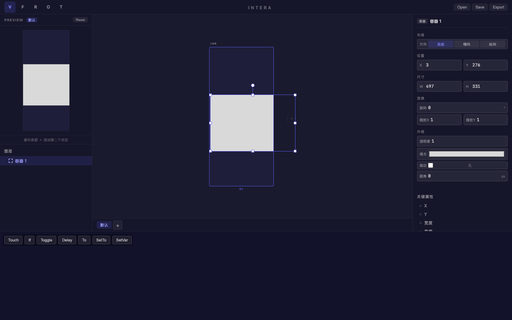
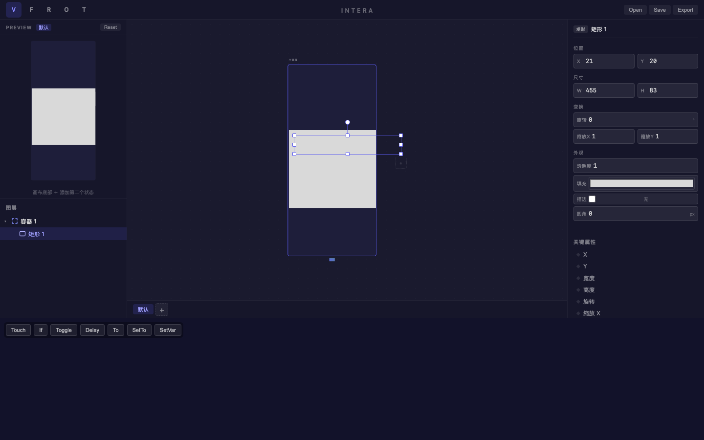
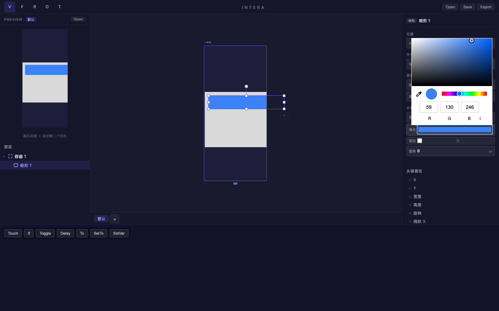
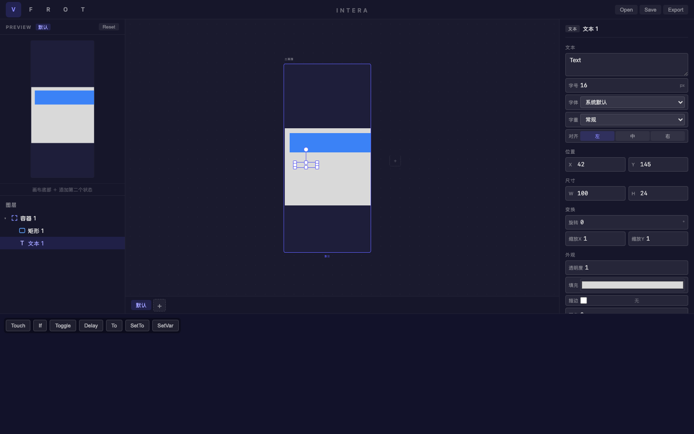
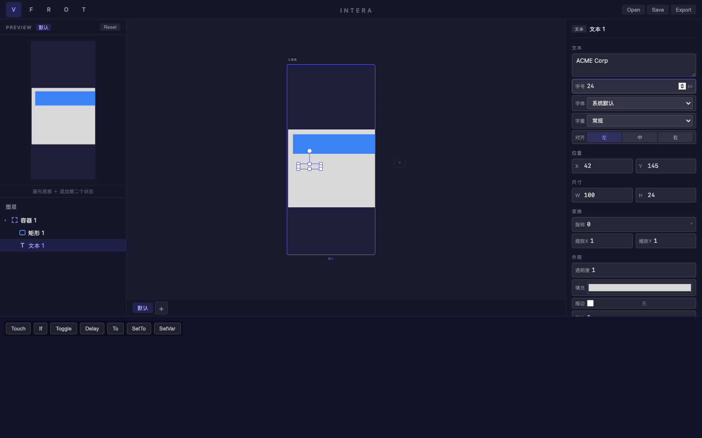
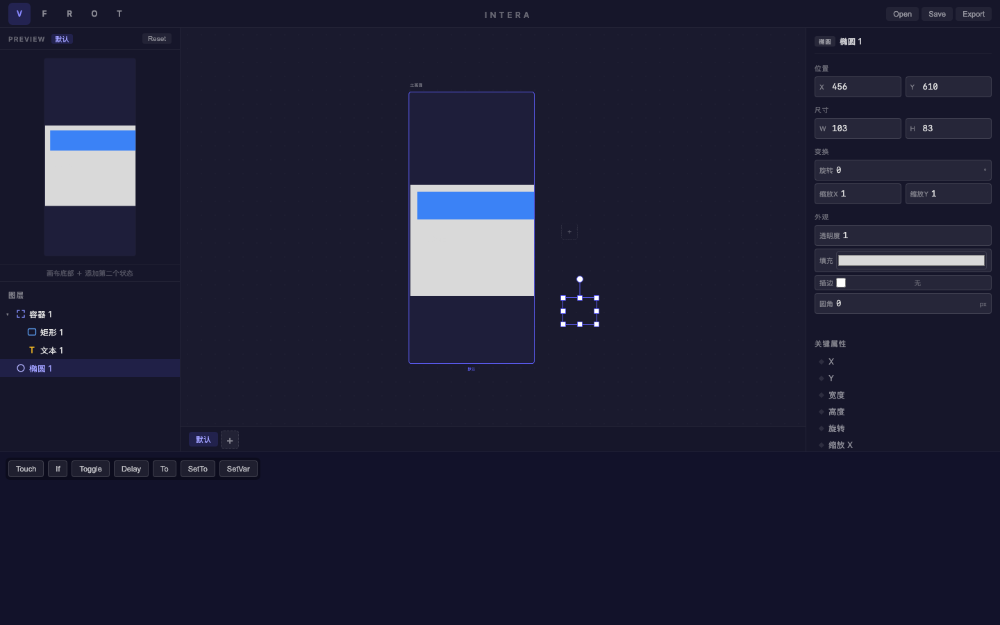
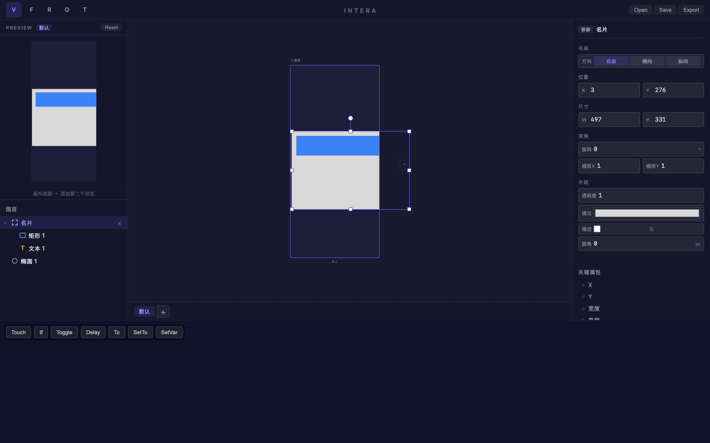
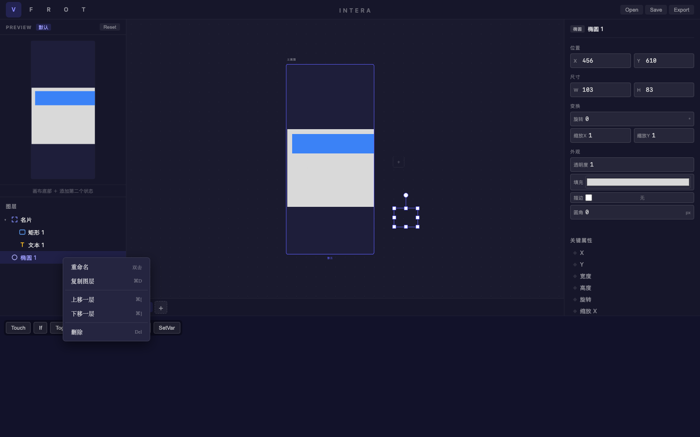
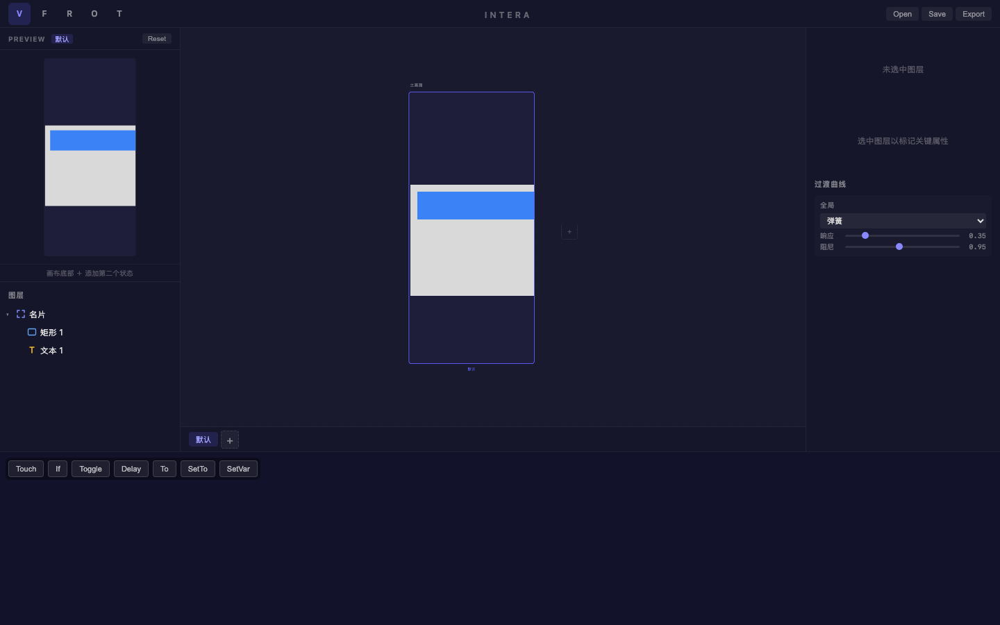
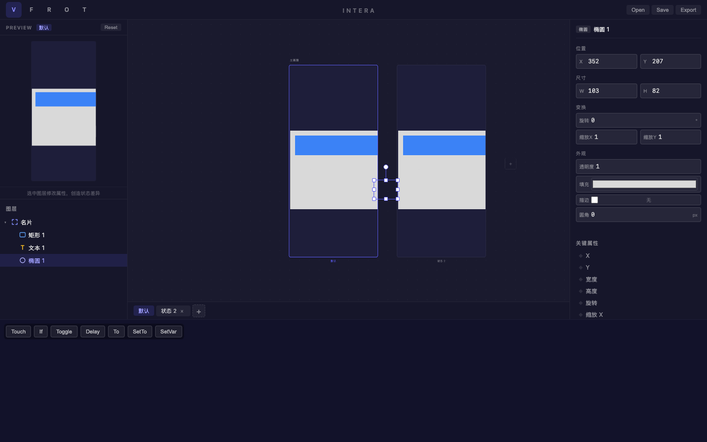

# 旅程: 零能力画像 — 名片卡片设计

## 画像

**∅ (零能力)** — 仅使用基础绘制 + 图层管理，不涉及多状态动画/曲线/Patch。

## 设计目标

设计一张简洁的名片卡片：一个 Frame 容器内包含蓝色标题矩形、公司名文本、装饰椭圆。
覆盖能力：绘制图形、创建容器、添加文本、图层嵌套、重命名、属性编辑、右键操作。

## 过程

### Step 01 — 打开页面

**看到**: 完整四栏布局，V 工具激活，空画布引导 "按 R 绘制矩形"。
**决策**: 按 F 创建 Frame 容器作为名片外框。

### Step 02 — 创建容器

**看到**: 白色容器 (497×331) 出现在画布上，图层面板显示 "容器 1" + 四角框架图标。
**决策**: 按 R 在容器内绘制标题矩形。

### Step 03 — 绘制标题矩形

**看到**: 矩形自动嵌套在容器内！图层树: 容器 1 → 矩形 1。蓝色方块图标。
**决策**: 修改矩形颜色为蓝色。

### Step 04 — 修改颜色

**看到**: 矩形变为蓝色 (#3b82f6)，颜色选择器弹出，预览面板同步更新。
**决策**: 创建文本图层。

### Step 06 — 创建文本

**看到**: 文本 "Text" 嵌套在容器内，黄色 T 图标。右面板完整显示文本属性。
**决策**: 修改文本内容和字号。

### Step 07 — 编辑文本属性

**看到**: 文本改为 "ACME Corp"，字号改为 24。属性面板即时反映修改。
**决策**: 创建椭圆装饰。

### Step 08 — 绘制椭圆 (第一次 — 容器外)

**看到**: 椭圆创建在容器外 (X=456, Y=610)，独立顶层图层。紫蓝椭圆图标。
**决策**: 用右键菜单删除，重新在容器内绘制。

### Step 09 — 双击重命名

**看到**: "容器 1" → "名片"，右面板标题即时同步。重命名体验丝滑。
**决策**: 右键删除容器外的椭圆。

### Step 10 — 右键菜单

**看到**: 右键弹出上下文菜单 (重命名/复制/上移/下移/删除)，样式美观。
**决策**: 点击删除。

### Step 11 — 删除椭圆

**看到**: 椭圆被成功删除，图层树只剩: 名片 → 矩形 1 / 文本 1。
**决策**: 在容器内重新绘制椭圆。

### Step 12 — 容器内绘制椭圆

**看到**: 椭圆正确嵌套在容器内！图层树: 名片 → 矩形 1 / 文本 1 / 椭圆 1。
**决策**: 添加第二个显示状态。

### Step 13 — 添加第二状态

**看到**: 状态栏出现 "默认" + "状态 2"，画布并排显示两个画板。
**决策**: 完成设计，保存。

### Step 14 — 最终设计

**看到**: 完整的名片卡片设计，双状态画板并排，所有图层类型图标正确显示。

## 摩擦点

1. **无摩擦**: 绘制/嵌套/颜色/文本/重命名/右键 — 全部丝滑
2. **轻微注意点**: 在容器外绘制图形不会自动嵌套 (这是正确行为，但零基础用户需要学习)
3. **图标效果**: SVG 类型图标颜色区分清晰 (容器紫蓝框架/矩形蓝/文本黄/椭圆紫蓝)

## 结论

**✅ 通过** — 零能力画像旅程丝滑完成，无阻塞性摩擦。

| 功能 | 状态 |
|---|---|
| 绘制图形 (R/O/F/T) | ✅ |
| 容器自动嵌套 | ✅ |
| 文本编辑 + 字号 | ✅ |
| 颜色选择器 | ✅ |
| 双击重命名 | ✅ |
| 右键菜单 (删除) | ✅ |
| 图层类型图标 | ✅ |
| 添加显示状态 | ✅ |
| 属性面板即时响应 | ✅ |
