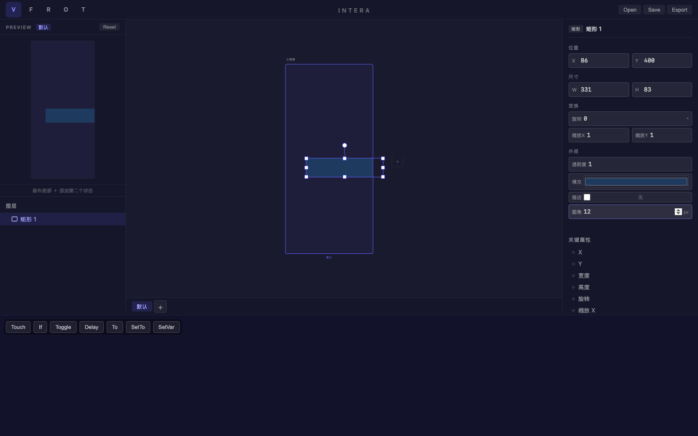
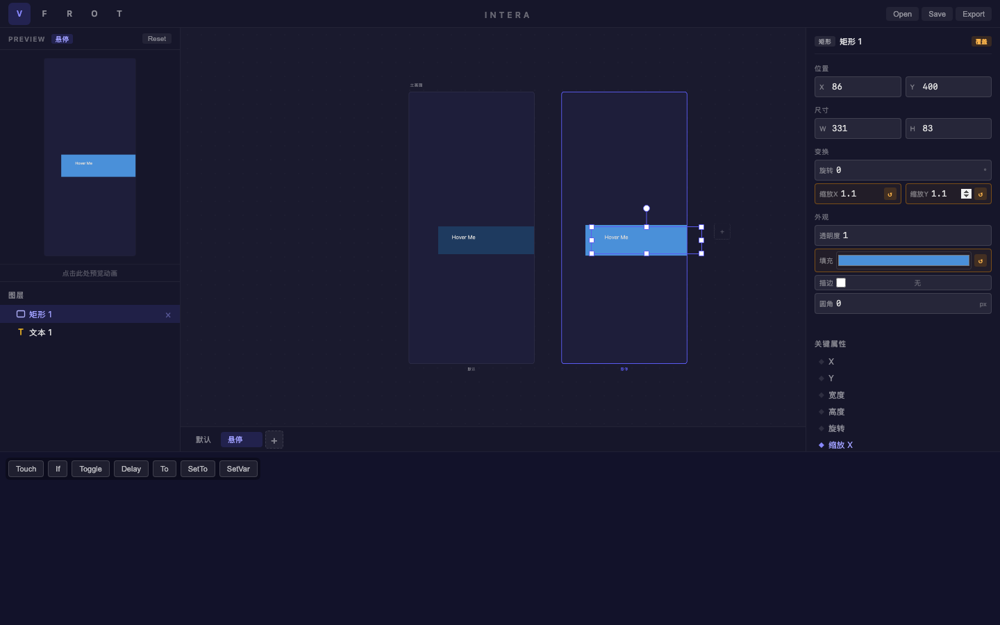

# 旅程: {states} 画像 — 按钮悬停状态动效

## 画像

**{states}** — 掌握多显示状态，创建状态间的属性差异。

## 设计目标

设计按钮悬停效果：默认状态深蓝色按钮，悬停状态变为亮蓝 + 放大 1.1x。
覆盖能力：绘制、多状态创建、状态间属性覆盖、预览。

## 过程

### Step 01-02 — 创建按钮矩形

创建 331×83 的矩形作为按钮基底。

### Step 03 — 设置外观

深蓝色 (#1e3a5f) + 圆角 12px。颜色选择器和圆角属性修改流畅。

### Step 04 — 添加文本

按钮上添加 "Hover Me" 文本标签。

### Step 05-06 — 创建 "悬停" 状态

- 添加第二状态并重命名为 "悬停"
- 双画板并排显示
- 预览面板标题同步更新为 "悬停"

### Step 07 — 悬停状态属性修改 (核心步骤)

在 "悬停" 状态下修改矩形属性：
- 填充: #4a90d9 (亮蓝)
- 缩放X/Y: 1.1 (放大效果)

**覆盖标记 ↺** 自动出现在修改的属性旁边 ✓
**关键属性 ◆** 自动标记缩放 X ✓
双画板视觉差异一目了然：左侧深蓝 vs 右侧亮蓝+放大

### Step 08-09 — 预览验证

切回默认状态，预览面板点击触发状态切换。

## 摩擦点

**无摩擦** — 所有操作丝滑完成：
- 多状态创建和切换流畅
- 覆盖标记 (橙色 ↺) 直观清晰
- 双画板对比效果出色
- 状态重命名体验一致

## 结论

**✅ 通过** — states 能力验证完毕，覆盖标记系统是亮点功能。

| 功能 | 状态 |
|---|---|
| 添加显示状态 | ✅ |
| 状态重命名 | ✅ |
| 状态切换 | ✅ |
| 属性覆盖创建 | ✅ |
| 覆盖标记 (↺) | ✅ |
| 关键属性标记 (◆) | ✅ |
| 双画板对比 | ✅ |
| 预览面板 | ✅ |
