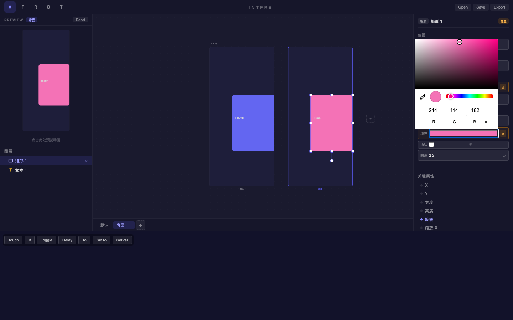
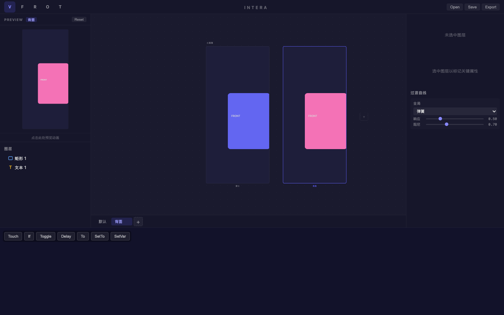
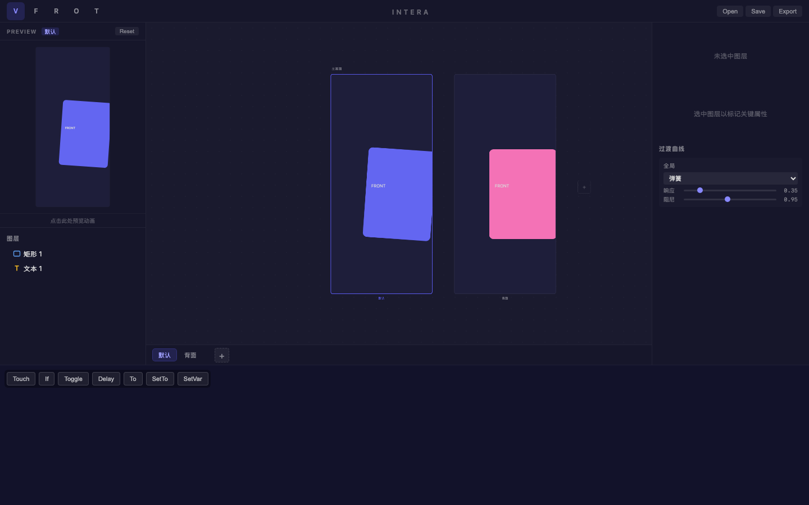

# 旅程: {states, curves} — 卡片翻转弹簧效果

## 画像

**{states, curves}** — 多状态 + 弹簧曲线配置。

## 设计目标

设计卡片翻转效果：默认状态靛蓝正面 → 背面粉色 + 旋转 180°，弹簧曲线实现自然回弹。

## 过程

### Step 01 — 创建卡片

靛蓝色 (#6366f1) 圆角矩形 (16px 圆角)。

### Step 02 — 添加文本

卡片上添加 "FRONT" 文本标签。

### Step 03 — 创建 "背面" 状态

双状态 "默认" + "背面"，重命名成功。

### Step 04 — 背面状态属性修改

在 "背面" 状态下：
- 填充: #f472b6 (粉色)
- 旋转: 180°

覆盖标记 ↺ 自动出现。双画板对比：左蓝右粉，效果鲜明。

### Step 05 — 弹簧曲线调整

全局弹簧曲线配置：
- 响应: 0.50 (更慢的响应 → 更有弹跳感)
- 阻尼: 0.70 (降低阻尼 → 更多回弹)

### Step 06 — 切回默认状态

切换到默认状态时，弹簧过冲效果清晰可见 — 卡片从 180° 回弹到 0°，
在截图中捕捉到了弹簧振荡的中间帧。完美展现物理弹簧行为。

## 摩擦点

**无阻塞性摩擦**：
- 旋转属性在覆盖状态下完美工作
- 弹簧曲线调节流畅，效果即时可见
- 双画板对比让状态差异一目了然

## 结论

**✅ 通过** — states + curves 双能力验证完毕。

| 功能 | 状态 |
|---|---|
| 旋转属性覆盖 | ✅ |
| 颜色属性覆盖 | ✅ |
| 弹簧曲线配置 | ✅ |
| 弹簧过冲效果 | ✅ |
| 双画板差异对比 | ✅ |
| 预览动画 | ✅ |
