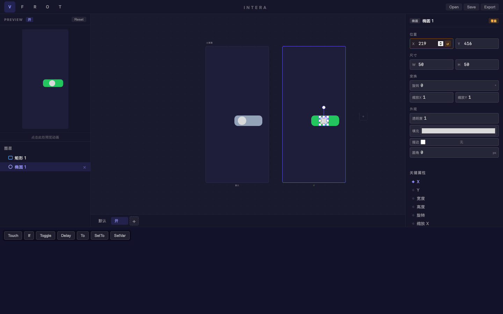
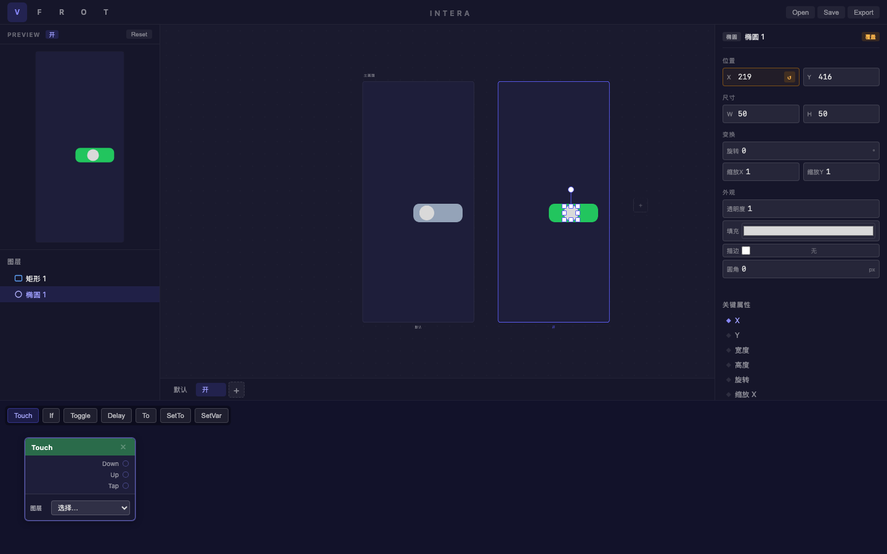
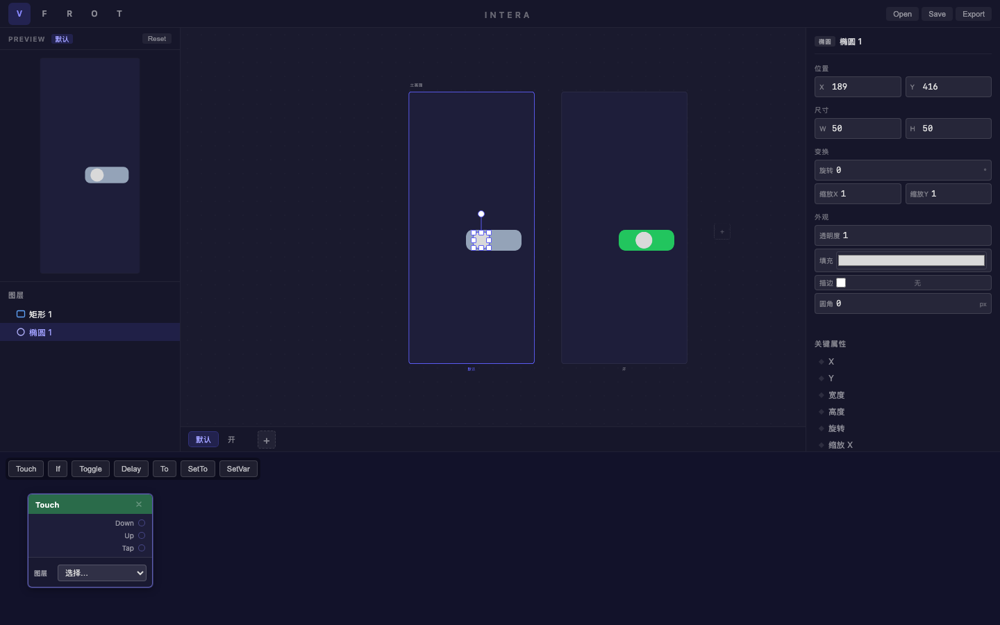

# 旅程: {states, patch} — Toggle 开关交互

## 画像

**{states, patch}** — 多状态 + Patch 交互触发。

## 设计目标

设计 Toggle 开关：默认灰色关闭 (圆点左侧) → 开启绿色 (圆点右侧)。
通过 Touch Patch 触发状态切换。

## 过程

### Step 01-02 — 创建开关组件

- 灰色圆角矩形 (20px 圆角) 作为开关轨道
- 白色椭圆作为滑块 (50×50)

### Step 03 — 创建 "开" 状态

双状态 "默认" + "开"。

### Step 04 — "开" 状态属性修改

- 背景: #22c55e (绿色)
- 圆点: X 位置右移 30px

覆盖标记 ↺ 和关键属性 ◆ X 正确显示。
双画板对比效果出色：灰色关闭 vs 绿色开启，像真实的 iOS 开关。

### Step 05 — 打开 Patch 编辑器

Touch Patch 节点创建成功：
- 绿色卡片 "Touch"
- 事件端口: Down / Up / Tap
- 图层选择下拉框: "选择..."

### Step 06 — 最终对比

切回默认状态，完整展示两种状态的差异。

## 摩擦点

1. **Patch 连线操作**: Touch 节点创建后需要继续连接 Toggle/To 节点来完成交互链路。
   这部分需要更深入的 Patch 编辑器操作 (拖拽连线)。

## 结论

**✅ 通过** — states + patch 基本功能验证完毕。

| 功能 | 状态 |
|---|---|
| 椭圆位置覆盖 | ✅ |
| 矩形颜色覆盖 | ✅ |
| Touch Patch 创建 | ✅ |
| Patch 端口显示 | ✅ |
| 双画板对比 | ✅ |
