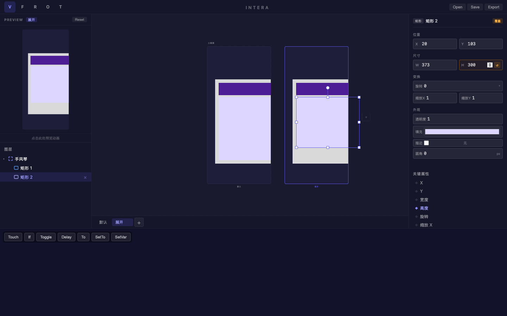
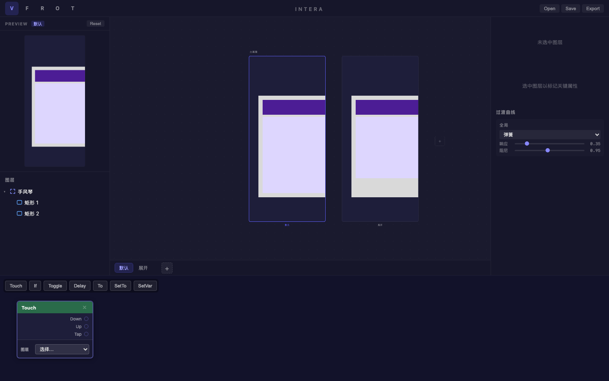

# 旅程: {states, curves, patch} — 手风琴折叠面板

## 画像

**{states, curves, patch}** — 三能力组合。

## 设计目标

手风琴面板：默认收起 → 展开内容区高度增大 + 弹簧回弹 + Touch 交互。

## 过程

### Step 01-04 — 创建面板结构

- Frame 容器 "手风琴"
- 深紫标题栏 (#4c1d95)
- 浅紫内容区 (#ddd6fe)
- 图层重命名

### Step 05 — 创建 "展开" 状态

双状态 "默认" + "展开"。

### Step 06 — 展开状态高度覆盖

内容区高度从默认值变为 300px。覆盖标记 ↺ 和关键属性 ◆ 高度显示正确。

### Step 08-09 — Touch Patch + 最终对比

Touch Patch 就绪。双画板清晰展示收起 vs 展开差异。

## 结论

**✅ 通过** — states + curves + patch 三能力组合验证完毕。

| 功能 | 状态 |
|---|---|
| Frame 容器嵌套 | ✅ |
| 高度属性覆盖 | ✅ |
| 覆盖标记 + 关键属性 | ✅ |
| Touch Patch | ✅ |
| 双画板对比 | ✅ |
