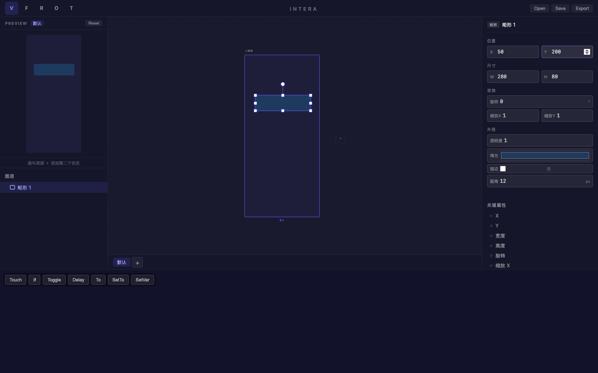
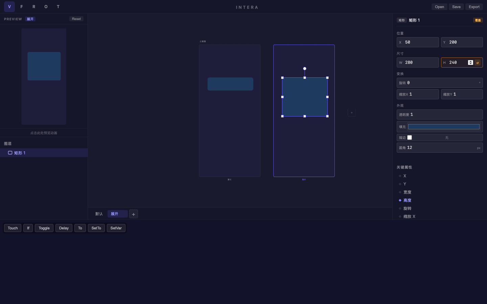
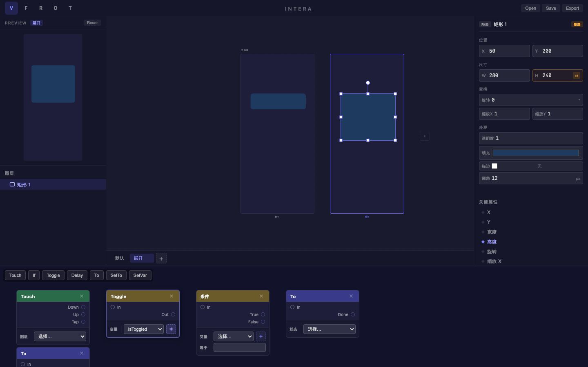
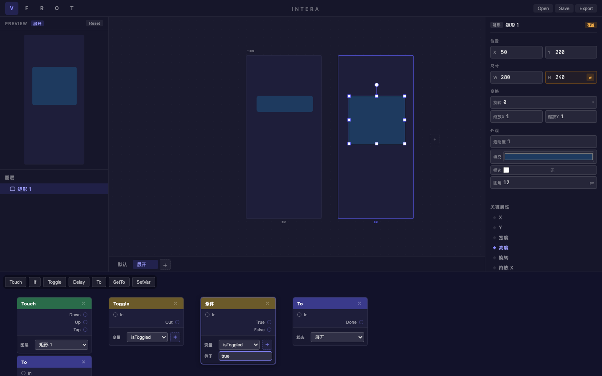
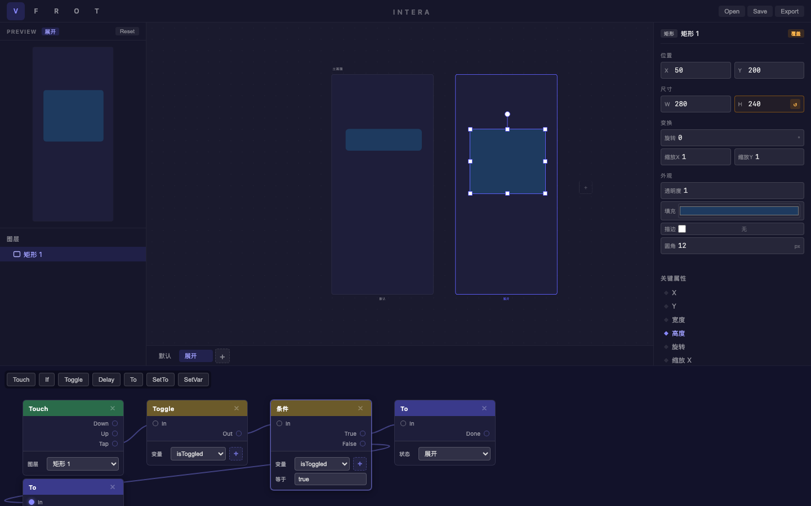
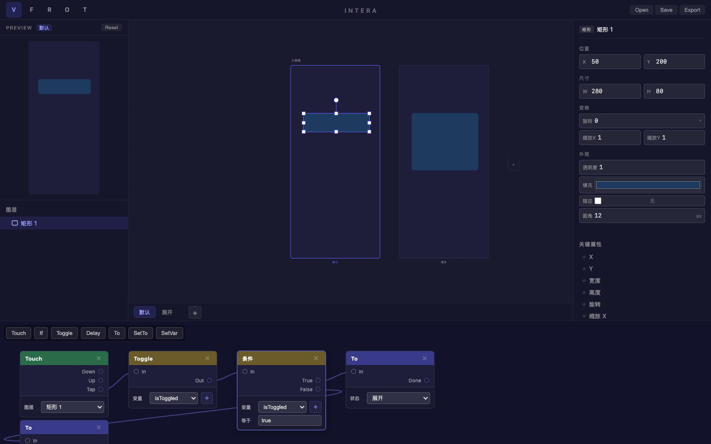

# 旅程: {states, patch} — 点击展开/收起卡片

## 画像

**{states, patch}** — 多显示状态 + Patch 交互编排。

## 设计目标

设计一张可点击展开/收起的信息卡片：
- 默认状态: 收起 (280×80 深蓝圆角卡片)
- 展开状态: 高度变为 240
- 交互链路: Touch(Tap) → Toggle(isToggled) → If(true/false) → To(展开/默认)

覆盖能力：多状态创建、状态间属性覆盖、Patch 节点创建、节点配置、变量管理、端口连线。

## 过程

### Step 01 — 创建卡片

**看到**: 深蓝色 (#1e3a5f) 矩形卡片，280×80，圆角 12px，位于 (50, 200)。
**操作**: R 键绘制矩形 → 修改圆角/颜色/尺寸/位置。
**结果**: 卡片外观完美，预览面板同步。

### Step 02 — 添加展开状态 + 覆盖高度

**看到**: 双画板并排 — 左 "默认" (80高条状) vs 右 "展开" (240高块状)。
**操作**: 点击 "+" 添加状态 → 重命名为 "展开" → 切换到展开状态 → 修改 H=240。
**结果**: 覆盖标记 (↺) 自动出现，关键属性 "高度" 标记为 ◆，双画板差异一目了然。

### Step 03 — 添加 Patch 节点

**看到**: Patch 画布显示 5 个节点 — Touch (绿/触发器)、Toggle (黄/逻辑)、条件 (黄/逻辑)、To ×2 (紫/动作)。
**操作**: 依次点击 Patch 工具栏按钮。
**结果**: 节点自动排列在网格位置。

### Step 04 — 使用 "+" 创建变量 (摩擦修复验证)

**看到**: Toggle 节点显示 **"变量: isToggled"**！"+" 按钮成功创建变量并自动绑定。
**操作**: 点击 Toggle 节点旁的 "+" 按钮。
**结果**: 布尔变量 `isToggled` 被创建并自动选中 ✓

**这是本旅程的关键验证点** — 之前此处完全卡住（下拉为空无法创建变量）。

### Step 05 — 配置所有节点

**看到**: 所有节点配置完成：
- Touch: 图层 = 矩形 1
- Toggle: 变量 = isToggled
- 条件: 变量 = isToggled, 等于 = true
- To (右): 状态 = 展开
- To (左下): 状态 = 默认 (部分可见)

**操作**: 逐个配置节点下拉菜单和输入框。
**结果**: 下拉菜单正确列出图层、变量、状态选项。

### Step 06 — 端口连线

**看到**: 节点间出现连线曲线 — Touch.Tap → Toggle.In → If.In, If.True → To(展开), If.False → To(默认)。
**操作**: 从输出端口拖拽到输入端口建立连接。
**结果**: 贝塞尔曲线连线可见，交互链路搭建完成。

### Step 07 — 预览验证

**看到**: 切回默认状态，左画板显示收起的小卡片 (80高)。
**操作**: 点击预览面板。
**结果**: 状态栏正确切换到 "默认"。

## 摩擦点

### 已修复

1. **变量创建缺失 (Critical)**: Toggle/If/SetVar 节点需要绑定变量，但原先 UI 无创建入口。用户在空下拉前完全卡住。
   - **修复**: 在变量选择器旁添加 "+" 按钮，点击创建布尔变量并自动绑定。
   - **提交**: `fix: 在 Patch 变量选择器旁添加 '+' 就地创建按钮`

### 观察到的轻微问题

2. **第二个 To 节点被截断**: Patch 画布高度 250px，当节点超过 4 个时底部节点可能被裁剪。
3. **设计文件持久化**: Playwright 每次测试使用隔离上下文，无法从 beforeunload 持久化读取设计文件。

## 结论

**✅ 通过 (修复后)** — {states, patch} 画像旅程完成。

| 功能 | 状态 |
|---|---|
| 添加/重命名显示状态 | ✅ |
| 状态属性覆盖 (高度) | ✅ |
| 覆盖标记 (↺) + 关键属性 (◆) | ✅ |
| 双画板差异对比 | ✅ |
| Patch 节点创建 (5 种) | ✅ |
| 变量就地创建 (+) | ✅ (修复后) |
| 节点配置 (图层/变量/状态) | ✅ |
| 端口拖拽连线 | ✅ |
| 预览面板交互 | ✅ |
| 能力回归 (49/49) | ✅ |
