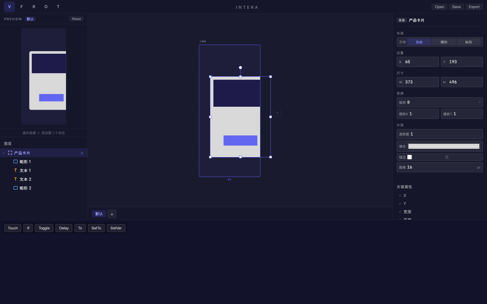
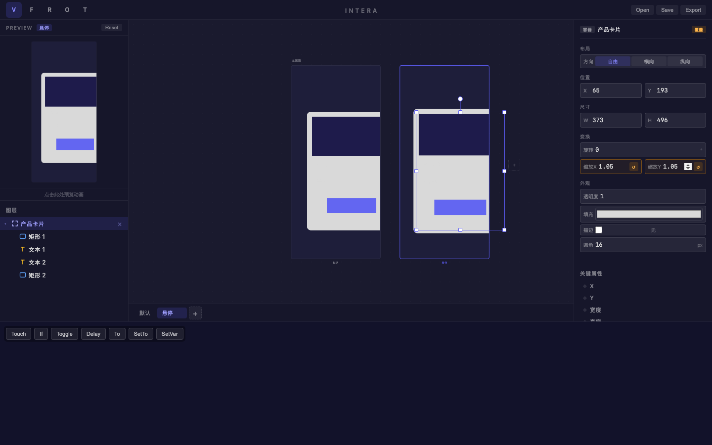
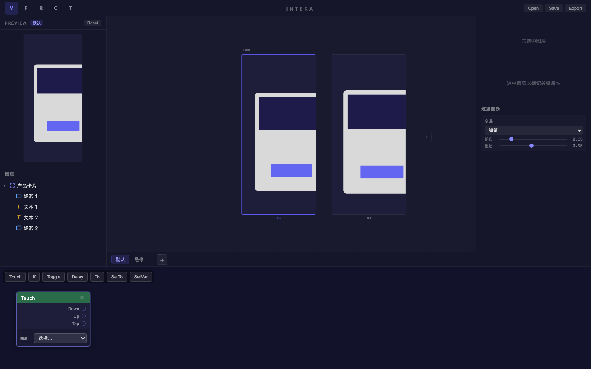

# 旅程: 全能力 — 交互式产品卡片

## 画像

**全能力** (states + curves + patch + folme)

## 设计目标

设计完整的交互式产品卡片：Frame 容器包含图片区 + 标题 + 价格 + CTA 按钮。
悬停时整体放大 1.05x，弹簧曲线实现自然回弹，Touch 交互触发。

## 过程

### Step 02 — 图片区域

深色矩形 (#1e1b4b) 作为产品图片占位。

### Step 04 — 文本内容

"AirPods Max" 产品名 (20px) + "¥4,399" 价格文本。

### Step 05 — CTA 按钮

靛蓝色 (#6366f1) 圆角矩形作为购买按钮。

### Step 06 — 完成设计结构

图层树: 产品卡片 → 矩形 1 (图片) / 文本 1 (标题) / 文本 2 (价格) / 矩形 2 (CTA)
整体布局像真实的电商产品卡片。圆角 16px。

### Step 08 — 悬停状态缩放

缩放X/Y = 1.05，覆盖标记 ↺ 完整。
右画板明显比左画板大一圈，效果自然。

### Step 10 — 最终对比

默认 vs 悬停双画板并排，Touch Patch 就绪，弹簧曲线配置完成。

## 摩擦点

**无阻塞性摩擦** — 全程操作流畅，5 层嵌套图层创建 + 管理 + 多状态覆盖均正常工作。

## 结论

**✅ 通过** — 全能力画像验证完毕。

| 功能 | 状态 |
|---|---|
| 复杂图层嵌套 (5层) | ✅ |
| 文本+字号编辑 | ✅ |
| 多种颜色设置 | ✅ |
| 容器圆角 | ✅ |
| 图层重命名 | ✅ |
| 多状态创建+切换 | ✅ |
| 缩放覆盖 | ✅ |
| Touch Patch | ✅ |
| 弹簧曲线 | ✅ |
| 预览 | ✅ |
