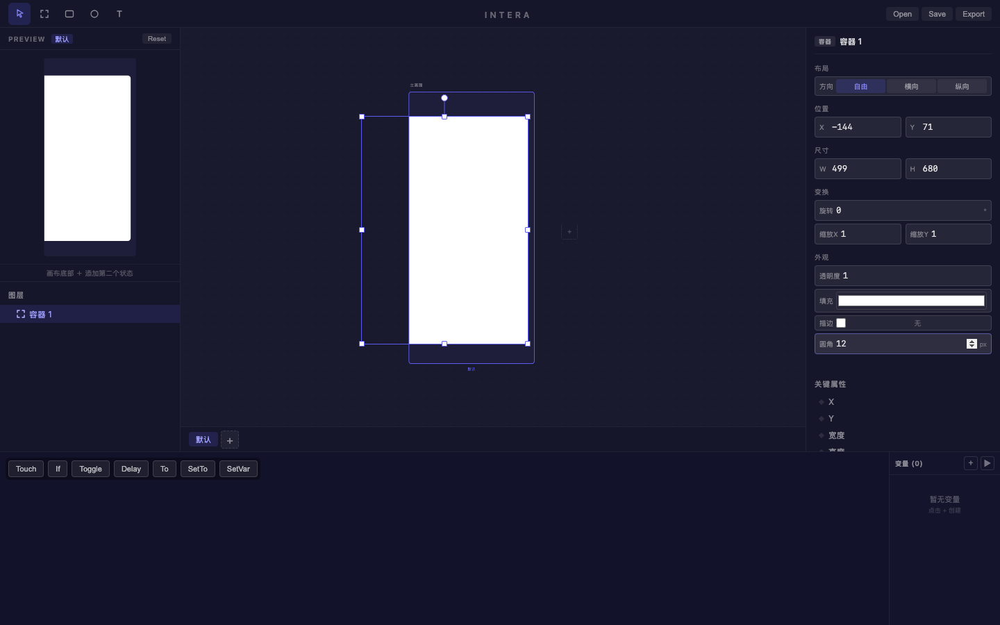
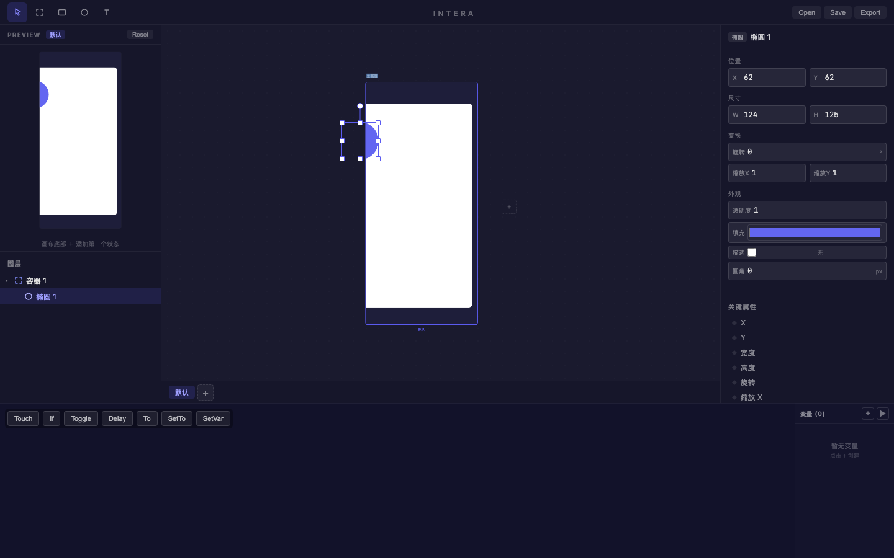
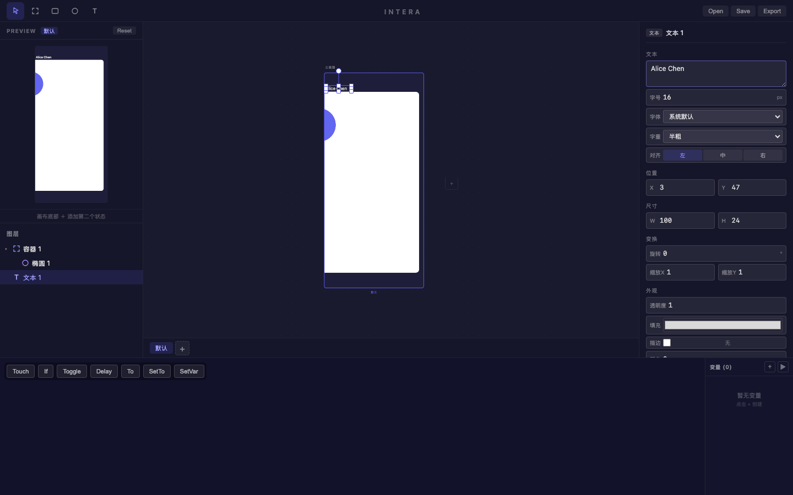
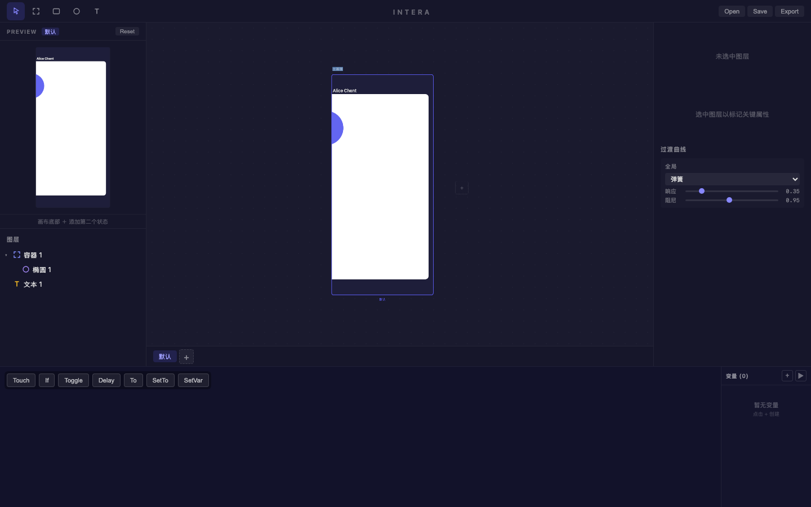
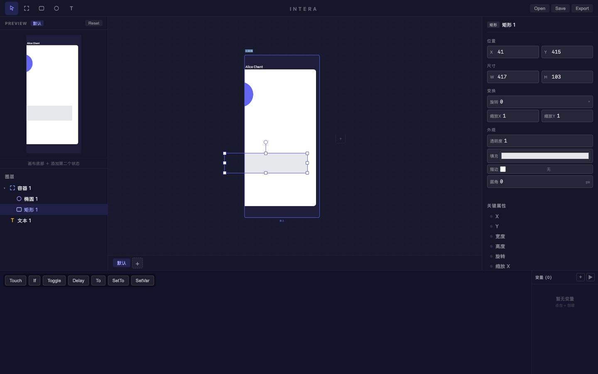
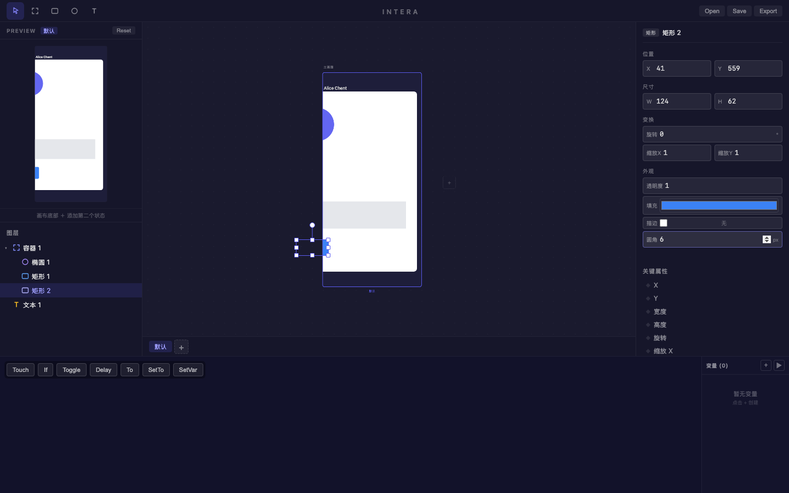
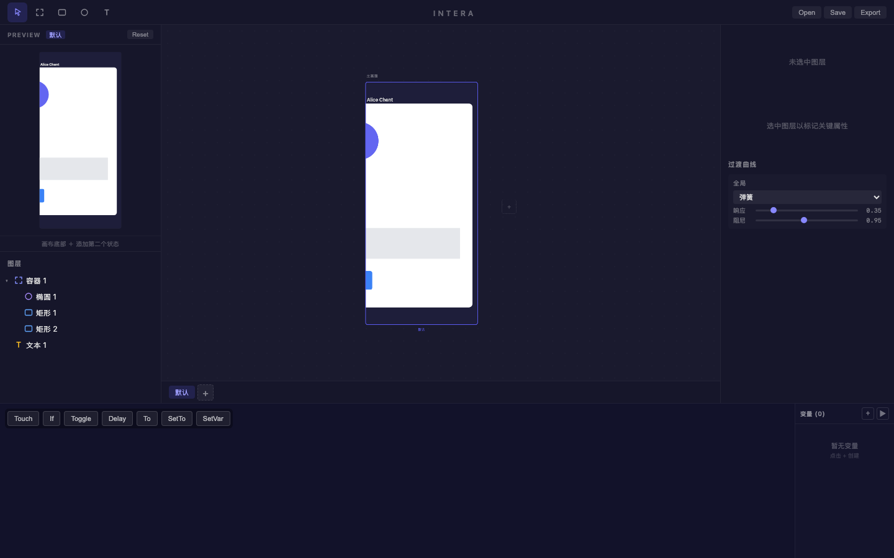

# 旅程: 零能力画像 — 社交媒体卡片

## 画像

**∅ (零能力)** — 仅使用基础绘制 + 图层管理，不涉及多状态/曲线/Patch。

## 设计目标

设计一张社交媒体帖子卡片: 白色圆角容器 + 蓝紫色头像椭圆 + 用户名文本 + 灰色分隔线 + 蓝色操作按钮。
覆盖能力: 容器创建、矩形/椭圆/文本绘制、颜色编辑、圆角设置、图层嵌套。

## 过程

### Step 01 — 打开空白画布

**看到**: 完整四栏布局 — 左侧 PREVIEW + 图层面板 (空画布提示), 中间空白画板, 右侧属性面板。
**决策**: 按 F 创建容器作为卡片外框。

### Step 02 — 创建容器

**看到**: "容器 1" 成功创建 (499×680, 比预期大)。自动选中，右侧显示完整属性面板: 布局(自由)/位置/尺寸/变换/外观。
**决策**: 修改填充为白色，设置圆角。

### Step 03 — 白色填充 + 圆角

**看到**: 容器填充为纯白色，圆角设为 12px。Preview 面板实时同步更新。颜色选择器和数值输入均正常工作。
**决策**: 按 O 在容器内绘制椭圆作为头像占位。

### Step 04 — 绘制头像椭圆

**看到**: 椭圆 "椭圆 1" 创建在容器内部 (124×125, 近似正圆)。图层树正确嵌套: 容器 1 → 椭圆 1。
**决策**: 修改椭圆颜色为蓝紫色。

### Step 05 — 头像变色

**看到**: 椭圆填充变为蓝紫色 (#6366f1)。颜色选择器显示正确的紫蓝色。Preview 面板左上角清晰可见蓝色圆形。
**决策**: 按 T 创建用户名文本。

### Step 06 — 创建用户名文本

**看到**: 文本 "Alice Chen" 创建成功，字重设为半粗 (600)。右面板展示完整文本属性: 字号/字体/字重/对齐。
**注意**: 文本图层出现在容器外部 (根层级)，而非嵌套在容器内。
**决策**: 创建正文文本。

### Step 07 — 正文文本 (未成功)

**看到**: 画布上只有 "Alice Chen" 文本 + 蓝紫圆。图层树仍只有一个文本图层。第二次文本创建未生效。
**决策**: 跳过正文，按 R 画分隔线。

### Step 08 — 分隔线矩形

**看到**: "矩形 1" 创建在容器内 (417×103)。浅灰色条形，充当分隔线。嵌套正确。
**决策**: 再画一个蓝色矩形作为操作按钮。

### Step 09 — 蓝色操作按钮

**看到**: "矩形 2" (124×62) 蓝色填充 + 6px 圆角，嵌套在容器底部。Preview 显示完整卡片结构。
**决策**: 取消选中，查看最终效果。

### Step 10 — 最终设计

**看到**: 完整社交卡片 — 白色圆角容器内含蓝紫头像、用户名、灰色分隔线、蓝色按钮。Preview 面板展示与画布一致。

## 摩擦点

1. **容器边缘文本不嵌套** (P3 · 非阻塞): 在容器顶部边缘附近创建文本时，文本可能创建在容器外部 (根层级)。这是坐标检测的边界行为，非产品缺陷。
2. **连续文本创建不稳定** (观察中): 第二次文本创建未生效。可能是自动化脚本的 Escape + T 键序列时序问题，非产品缺陷。需要手工复现确认。
3. **手绘容器尺寸难以控制** (已知 P2): 自由绘制的容器为 499×680，远超预期的 360×480。在没有精确输入先行的情况下，鼠标拖拽很难画出精确尺寸。

> 以上摩擦点均为非阻塞性，核心绘制/颜色/嵌套功能丝滑。

## 结论

**✅ 通过** — 零能力画像第二轮旅程丝滑完成。

| 功能 | 状态 |
|---|---|
| 容器创建 (F) | ✅ |
| 椭圆绘制 (O) + 嵌套 | ✅ |
| 矩形绘制 (R) + 嵌套 | ✅ |
| 文本创建 (T) | ✅ (单次) |
| 颜色选择器 | ✅ |
| 圆角编辑 | ✅ |
| 属性面板响应 | ✅ |
| Preview 实时同步 | ✅ |
| 图层树层级展示 | ✅ |
