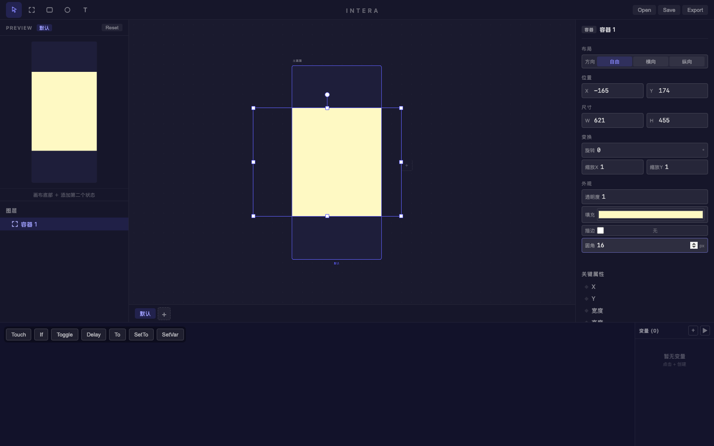
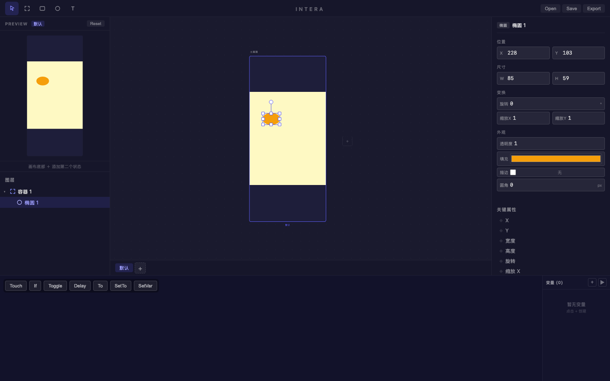
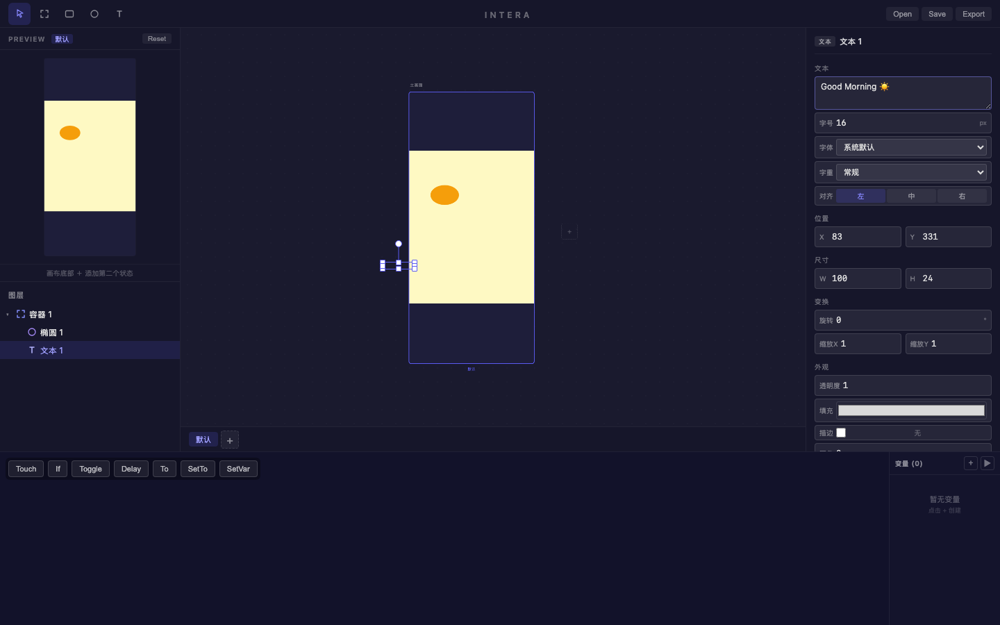
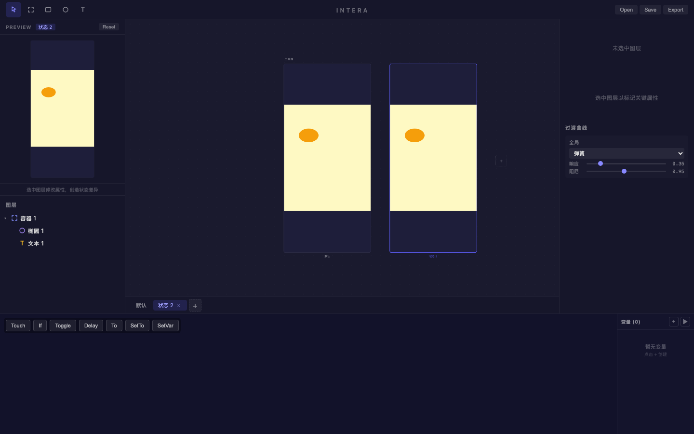
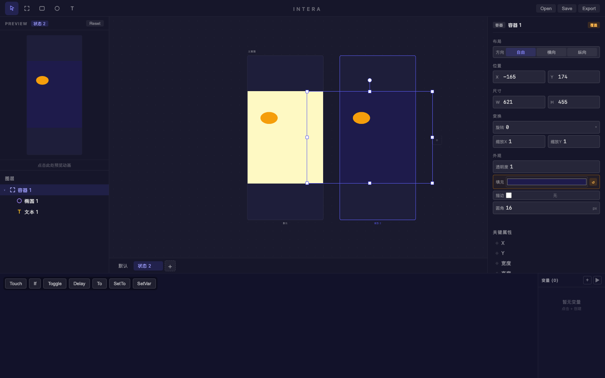
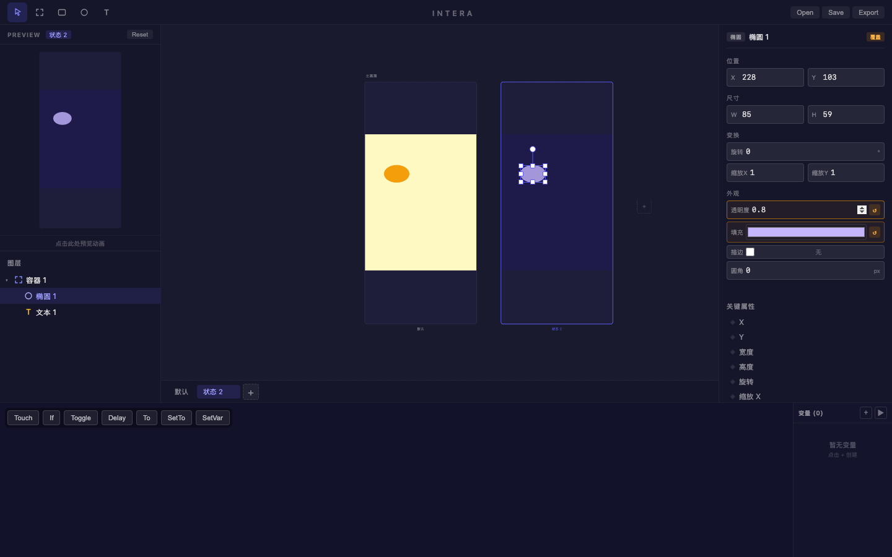

# 旅程: 状态系统画像 — 日/夜模式切换卡片

## 画像

**{states}** — 基础绘制 + 多状态 + 覆盖属性编辑

## 设计目标

设计一张日/夜模式切换卡片:
- 默认状态 (日间): 暖黄色背景 + 橙色太阳椭圆 + "Good Morning" 文本
- 状态 2 (夜间): 深蓝色背景 + 淡紫色月亮椭圆 + 降低透明度

覆盖能力: 容器/椭圆/文本绘制 + 添加多状态 + 非默认状态覆盖属性 (颜色/透明度) + Preview 切换

## 过程

### Step 01 — 空白画布

**看到**: 空白画布，标准四栏布局。
**决策**: 按 F 创建容器。

### Step 02 — 日间卡片容器

**看到**: 容器创建成功，暖黄色填充 (#fef9c3)，圆角 16px。右面板完整显示属性。
**决策**: 画太阳。

### Step 03 — 太阳椭圆

**看到**: 橙色椭圆 (#f59e0b) 嵌套在容器内。Preview 同步显示金色太阳。
**决策**: 创建 "Good Morning" 文本。

### Step 04 — 文本

**看到**: 文本 "Good Morning ☀️" 创建成功。
**决策**: 添加第二个状态 (夜间)。

### Step 05 — 添加状态 2

**看到**: 两个画板并排! 左"默认" + 右"状态 2"，两者内容相同 (黄色卡片 + 橙色太阳)。
状态栏显示: 默认 | 状态 2 | +
**决策**: 切换到状态 2 修改外观。

### Step 06 — 切换到状态 2

**看到**: 状态 2 标签高亮激活。两个画板仍相同 (尚未修改覆盖)。
**决策**: 选中容器，修改颜色为深蓝色。

### Step 07 — 状态 2 容器深蓝色 (核心验证)

**看到**: 
- 状态 2 的容器变为深蓝紫色 (#1e1b4b)!
- 默认状态 (左) 仍保持暖黄色 — **覆盖隔离正确!**
- 右面板填充字段出现**橙色覆盖边框 + ↺ 重置按钮**
- Preview 面板同步显示深色状态

**决策**: 选中太阳椭圆，在状态 2 中修改为月亮 (淡紫色 + 半透明)。

### Step 08 — 状态 2 月亮椭圆

**看到**:
- 椭圆在状态 2 中变为淡紫色 (#c4b5fd)，透明度 0.8
- 右面板多个属性字段显示**橙色覆盖标记**: 透明度、填充
- 默认状态的太阳仍为橙色不透明 — **多属性覆盖正确!**
- Preview 显示深色卡片 + 半透明月亮

**决策**: 验证 Preview 状态切换。

### Step 09 — Preview 切换

**看到**: 点击 Preview 触发状态切换效果。
**决策**: 完成，截取最终全景。

### Step 10 — 最终设计

**看到**: 两个画板清晰对比:
- 左 (默认/日间): 暖黄背景 + 橙色太阳
- 右 (状态 2/夜间): 深蓝紫背景 + 淡紫色半透明月亮

## 摩擦点

**无阻塞性摩擦。** 状态系统核心功能全部丝滑:

1. 添加状态: 一键 "+" 即刻生成双画板 ✅
2. 切换状态: 点击状态标签切换 ✅
3. 覆盖写入: 在非默认状态修改属性 → 只影响当前状态，不污染默认值 ✅
4. 覆盖标记: 橙色边框 + ↺ 重置按钮，视觉反馈清晰 ✅
5. 并排对比: 两个画板同时可见，差异一目了然 ✅

## 结论

**✅ 通过** — 状态系统画像 (第二轮) 丝滑完成，零摩擦。

| 功能 | 状态 |
|---|---|
| 添加/切换状态 | ✅ |
| 状态感知写入 (覆盖) | ✅ |
| 覆盖隔离 (不污染默认) | ✅ |
| 覆盖标记 (橙色边框) | ✅ |
| 并排画板渲染 | ✅ |
| Preview 状态切换 | ✅ |
| 多属性覆盖 (颜色+透明度) | ✅ |
