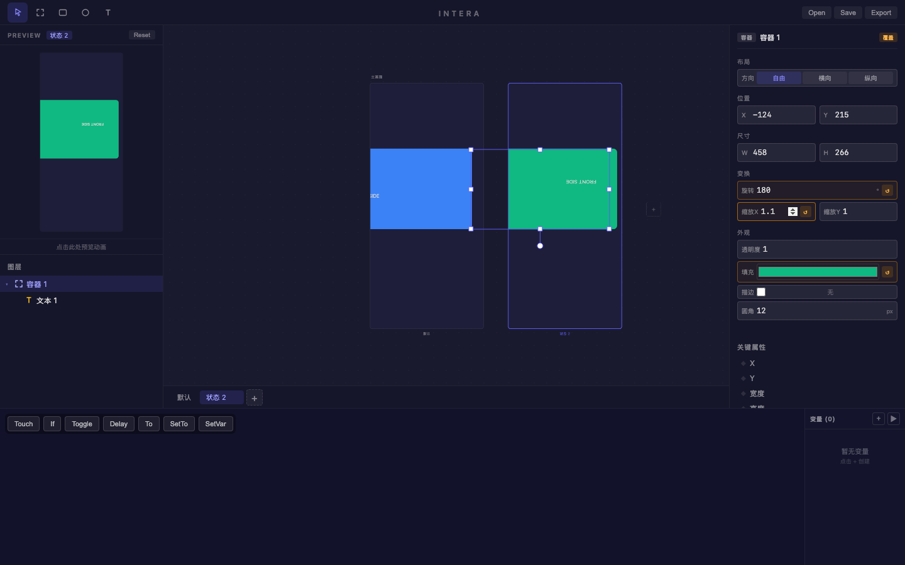
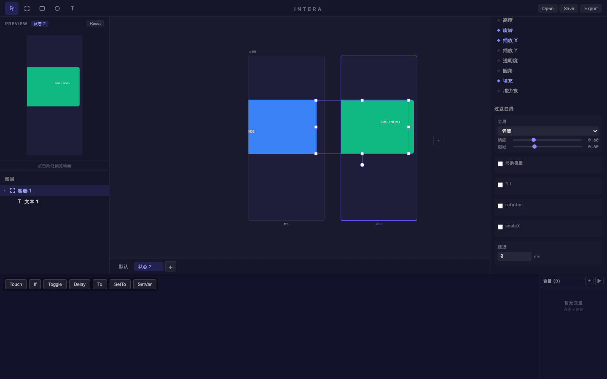

# 旅程: 状态·曲线画像 — 弹簧卡片翻转

## 画像

**{states, curves}** — 基础绘制 + 多状态 + 弹簧曲线参数编辑

## 设计目标

设计卡片翻转效果:
- 默认状态: 蓝色正面 + "FRONT SIDE" 文本
- 状态 2: 绿色背面 + 旋转 180° + 缩放 1.1x
- 调整弹簧参数: 响应 → 0.6, 阻尼 → 0.6 (更弹性的翻转感)

## 过程

### Step 01~03 — 基础构建

创建蓝色容器 (#3b82f6, 圆角 12px) + "FRONT SIDE" 文本。基础绘制流畅。

### Step 04~05 — 多状态

添加状态 2，两画板并排。切换到状态 2。

### Step 06 — 多属性覆盖 (核心验证)

**看到**:
- 左画板 (默认): 蓝色卡片 + 文本
- 右画板 (状态 2): **绿色** 卡片 + 旋转 180° + 缩放 1.1x
- 右面板三个属性均显示橙色覆盖边框 + ↺ 重置: 旋转 180 / 缩放X 1.1 / 填充绿色
- **三属性同时覆盖，互不干扰** ✅

### Step 07 — 弹簧曲线编辑 (核心验证)

**看到**:
- **过渡曲线面板**: 全局 "弹簧" 类型
- **响应: 0.68, 阻尼: 0.68** — 滑块交互成功 (从默认 0.35/0.95 修改)
- **关键属性标记**: 旋转(♦蓝), 缩放X(♦蓝), 填充(♦蓝) 显示被覆盖属性
- **元素覆盖 checkbox** + **属性级覆盖** (fill/rotation/scaleX) 均可见
- **延迟**: 0 ms 输入可编辑

### Step 08~09 — 最终设计

两画板清晰对比: 蓝色正面 (默认) vs 绿色翻转背面 (状态 2)。弹簧参数已调整为更弹性的 0.68/0.68。

## 摩擦点

**无阻塞性摩擦。** 曲线编辑全链路丝滑:

1. 弹簧类型选择: ✅
2. 响应/阻尼滑块交互: ✅ 
3. 关键属性标记 (蓝点区分有覆盖 vs 无覆盖): ✅
4. 元素级/属性级覆盖 checkbox: ✅
5. 延迟输入: ✅

## 结论

**✅ 通过** — 状态·曲线画像丝滑完成，零摩擦。

| 功能 | 状态 |
|---|---|
| 多属性覆盖 (旋转+缩放+填充) | ✅ |
| 弹簧曲线类型选择 | ✅ |
| 响应/阻尼滑块 | ✅ |
| 关键属性标记 (蓝点) | ✅ |
| 属性级曲线覆盖 | ✅ |
| 延迟配置 | ✅ |
