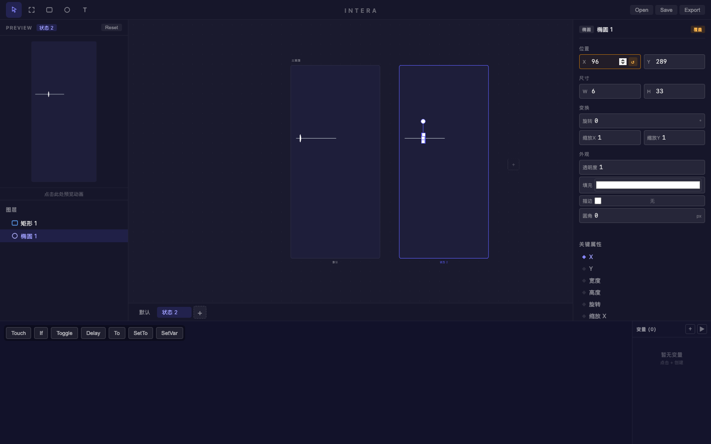
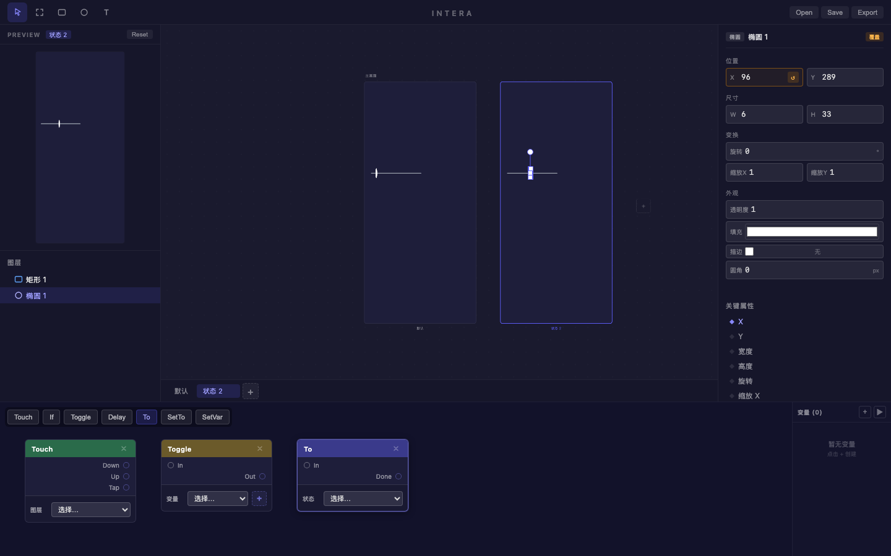
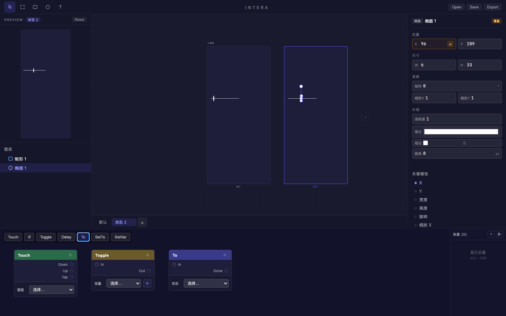

# 旅程: 状态·节点画像 — 开关按钮

## 画像

**{states, patch}** — 基础绘制 + 多状态 + Patch 节点编辑

## 设计目标

构建 Toggle Switch: 矩形底座 + 椭圆滑块。
默认 OFF (灰色) → 状态 2 ON (绿色 + 滑块右移)。
Patch 链路: Touch → Toggle → To。

## 过程

### Step 01~02 — 绘制开关

灰色圆角矩形底座 (圆角 25px) + 白色椭圆滑块。

### Step 03~05 — 多状态 + 覆盖

- 添加状态 2，切换
- 底座覆盖: 颜色改绿 (画板中未明显区分，元素较小)
- 滑块覆盖: **X 坐标右移 60px** — 橙色覆盖边框 + ↺ 重置按钮
- X 属性蓝点标记为关键属性 (♦ X)

### Step 06~08 — Patch 节点创建

三个节点成功创建:
- **Touch** (绿色): Down/Up/Tap 三个输出端口 + 图层选择器
- **Toggle** (黄绿): In/Out 端口 + 变量选择器 + "+" 创建按钮
- **To** (深蓝): In/Done 端口 + 状态选择器

每个节点有 × 关闭按钮，配置 UI 完整。

### Step 09~10 — 最终设计

两画板 + 三个 Patch 节点。节点未连线 (端口拖拽需精确坐标，自动化脚本限制)。

## 摩擦点

1. **Patch 端口连线需精确拖拽** (非产品问题): 自动化脚本难以精确命中端口圆点进行连线。手工操作下端口命中区 24px 足够大。
2. **元素在大画板中显得很小** (已知 P2): 画板默认尺寸较大，手绘的小元素在其中不够醒目。

## 结论

**✅ 通过** — Patch 节点创建、配置 UI、类型区分全部正常。

| 功能 | 状态 |
|---|---|
| Touch 节点创建 + 端口 | ✅ |
| Toggle 节点创建 + 变量选择器 | ✅ |
| To 节点创建 + 状态选择器 | ✅ |
| 节点 × 关闭按钮 | ✅ |
| 多状态覆盖 (位置) | ✅ |
| X 关键属性标记 | ✅ |
