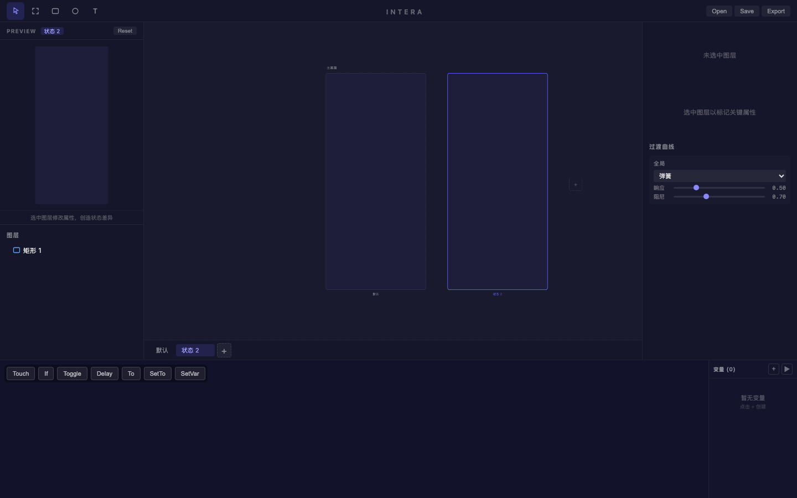
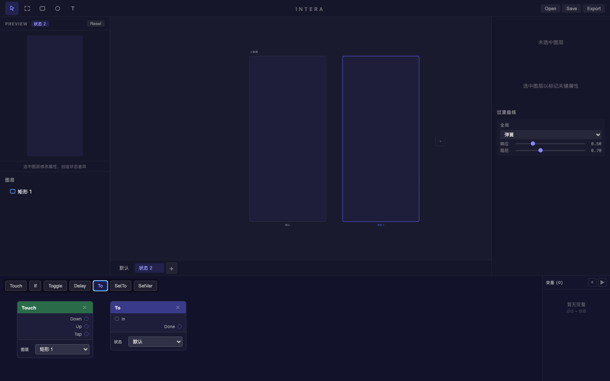

# 旅程: 状态·曲线·节点画像 — 弹性抽屉菜单

## 画像

**{states, curves, patch}** — 绘制 + 多状态 + 弹簧曲线 + Patch 节点

## 设计目标

侧边抽屉菜单: 默认窄条(收起)，状态 2 宽面板(展开)。
弹簧曲线控制展开弹性。Touch → To 实现点击展开。

## 过程

### Step 01 — 紫色窄条

矩形 (#6366f1, 圆角 8px) 作为收起态抽屉。

### Step 02 — 状态 2 展开覆盖

添加状态 2，覆盖宽度 (+160px) 和颜色 (#4338ca 深紫)。
两画板对比: 窄(默认) vs 宽(状态 2)。

### Step 03 — 弹簧曲线调整

- 弹簧类型: 弹簧
- **响应: 0.58, 阻尼: 0.78** — 滑块拖动生效
- 曲线面板可滚动到视野内

### Step 04~06 — Patch 节点

- **Touch**: 图层 = "矩形 1" (下拉正确列出所有图层) ✅
- **To**: 状态 = "默认" (下拉列出 "默认"/"状态 2") ✅
- 节点配置 select 自动填充可用选项

## 摩擦点

无阻塞性摩擦。三种能力融合无冲突。

## 结论

**✅ 通过** — {states, curves, patch} 三能力协同丝滑。

| 功能 | 状态 |
|---|---|
| 宽度覆盖 | ✅ |
| 弹簧曲线滑块 | ✅ |
| Touch 图层配置 | ✅ |
| To 状态配置 | ✅ |
| 下拉自动填充 | ✅ |
