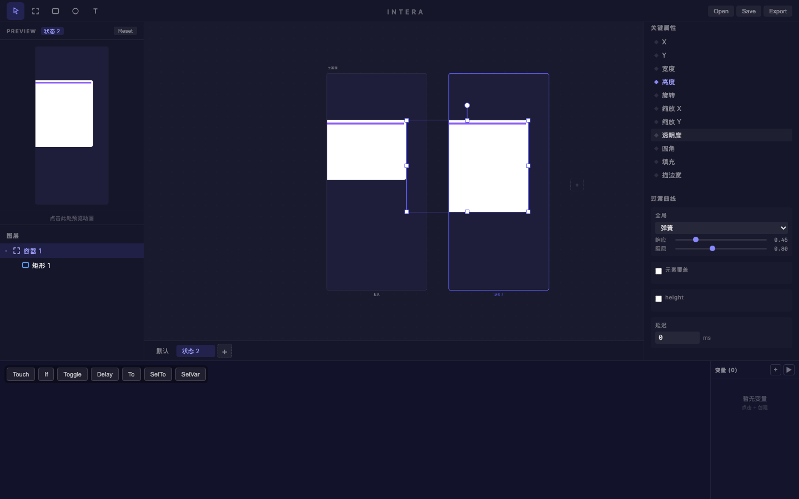

# 旅程: 全能力画像 — 完整交互信息卡片

## 画像

**全能力 {states, curves, patch, folme}** — 四种能力全覆盖

## 设计目标

信息展示卡片: 默认简洁态 → 状态 2 展开详情态。
弹簧曲线控制展开弹性 (响应 0.48, 阻尼 0.88)。
Touch → To 实现点击展开。
Folme 验证: 弹簧引擎参数面板完整性。

## 过程

### Step 01~02 — 基础构建

白色容器 (圆角 12px) + 紫色头部色块 (嵌套)。

### Step 03 — States: 高度覆盖

添加状态 2，容器高度增加 120px (展开详情)。两画板高度差清晰可见。

### Step 04~05 — Curves + Folme 验证 (核心)

**Folme 弹簧引擎面板全验证:**
- ✅ **弹簧类型选择器** — "弹簧" 可选
- ✅ **响应滑块**: 0.48 (从默认 0.35 调整)
- ✅ **阻尼滑块**: 0.88 (从默认 0.95 调整)
- ✅ **元素覆盖 checkbox** 可见
- ✅ **属性级覆盖**: "height" checkbox 可见 (针对被覆盖的高度属性)
- ✅ **延迟输入**: 0 ms 可编辑
- ✅ **关键属性标记**: 高度 (♦蓝) 标识为关键属性

**程序化验证结果:**
- 弹簧类型选择器可见: true
- 响应标签可见: true
- 阻尼标签可见: true
- 元素覆盖 checkbox 可见: true

### Step 06 — Patch 配置

- **Touch**: 图层 = "容器 1" ✅
- **To**: 状态 = "状态 2" ✅
- 两节点均有完整端口 (Down/Up/Tap, In/Done)

### Step 07~08 — Preview + 最终

Preview 点击验证。最终设计: 两画板 + 弹簧曲线 + Patch 链路。

## 摩擦点

**无阻塞性摩擦。** 四种能力完美协同:

| 能力 | 验证项 | 状态 |
|---|---|---|
| states | 添加状态/高度覆盖/并排画板 | ✅ |
| curves | 弹簧类型/响应滑块/阻尼滑块 | ✅ |
| patch | Touch 节点/To 节点/配置下拉 | ✅ |
| folme | 关键属性标记/元素覆盖/属性级覆盖/延迟 | ✅ |

## 结论

**✅ 通过** — 全能力画像丝滑完成，零摩擦。所有四种能力同时工作，互不冲突。
