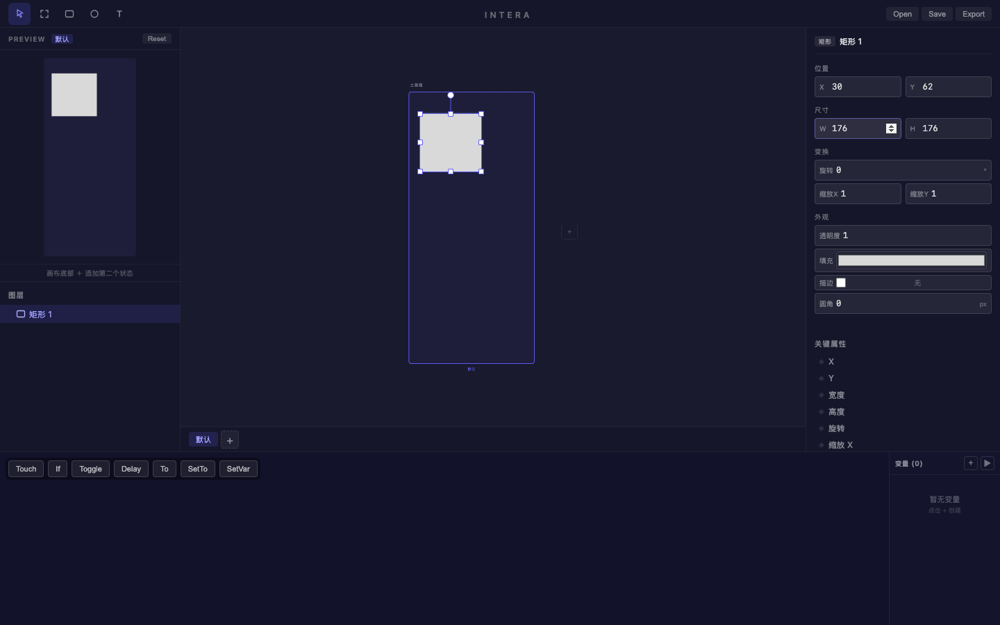
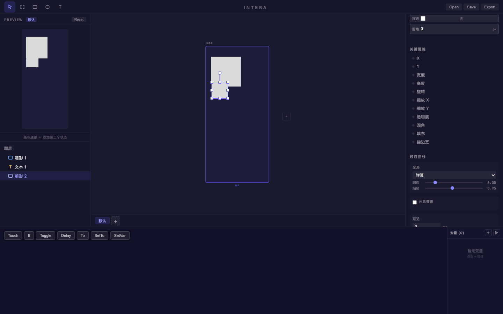
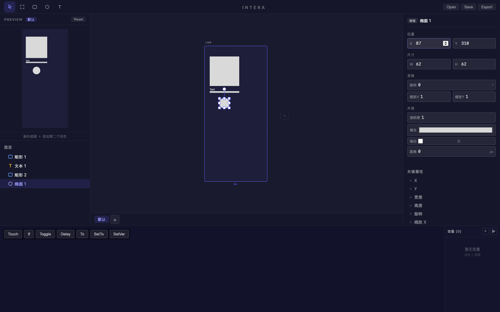
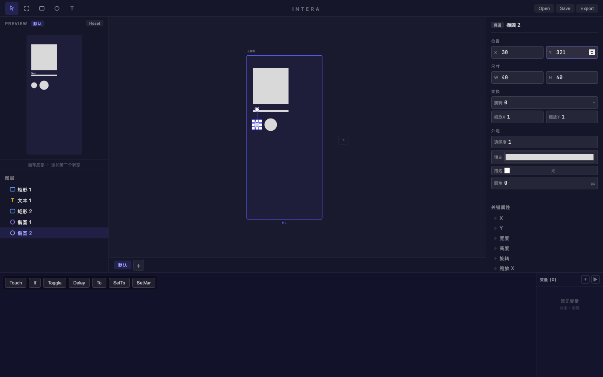
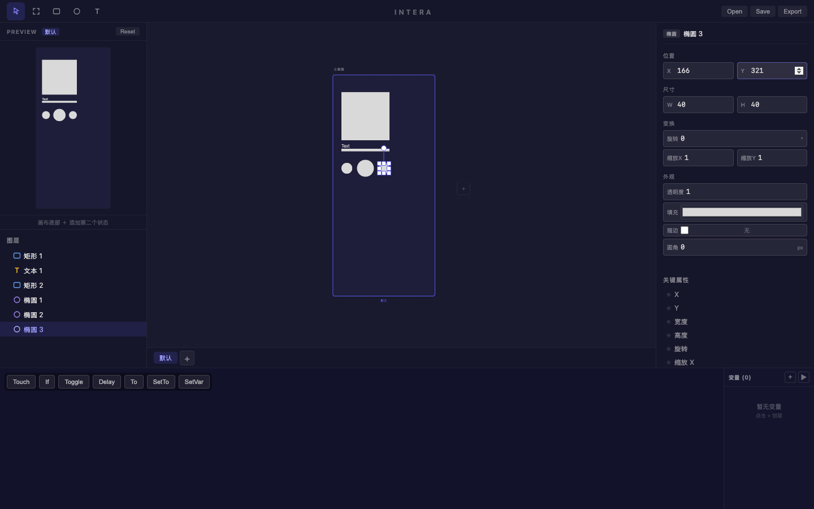
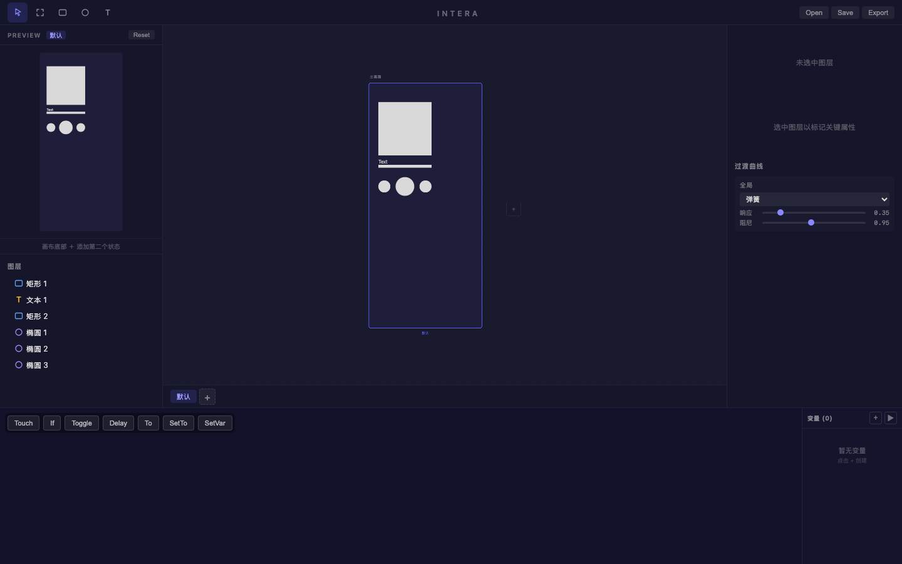

# 旅程: 零能力画像 — 音乐播放器 UI

## 画像

**∅ (零能力)** — 仅使用基础绘制工具 (矩形、椭圆、文本) + 属性面板数值编辑。第三轮验证。

## 设计目标

设计一个简洁的音乐播放器 UI：包含专辑封面 (矩形)、歌曲名 (文本)、进度条 (薄矩形)、三个播放控制按钮 (椭圆: 上一首/播放/下一首)。
覆盖能力：矩形、椭圆、文本工具绘制，属性面板精确定位 (X/Y/W/H)，图层管理。

## 最终布局

| 图层 | 类型 | X | Y | W | H | 说明 |
|---|---|---|---|---|---|---|
| 矩形 1 | rectangle | 30 | 30 | 176 | 176 | 专辑封面 |
| 文本 1 | text | 30 | 220 | — | — | 歌曲名 "Text" |
| 矩形 2 | rectangle | 30 | 260 | 176 | 12 | 进度条 |
| 椭圆 1 | ellipse | 87 | 310 | 62 | 62 | 播放按钮 (居中) |
| 椭圆 2 | ellipse | 30 | 321 | 40 | 40 | 上一首按钮 |
| 椭圆 3 | ellipse | 166 | 321 | 40 | 40 | 下一首按钮 |

## 过程

### Step 01-03 — 页面加载 + 工具栏确认

**看到**: Intera 编辑器完整加载，四栏布局，画板 "主画面" 居中，图层面板空。
**决策**: 按 R 切换到矩形工具绘制专辑封面。

### Step 04-13 — 绘制专辑封面 (矩形 1)

**过程**: 矩形工具画出矩形，初始 X:-186 (负数!)。通过属性面板逐字段修改: X→30, Y→30, W→176, H→176。
**摩擦**: 每次绘制图层 X 坐标为负数，需手动修正。Meta+a 全选后输入数值的工作流稳定。

### Step 14-30 — 绘制歌曲名文本 (文本 1)

**过程**: 按 T 切换文本工具，点击画布创建文本。初始 X:-164。通过属性面板修正 X→30, Y→220。
**摩擦**: 文本宽度 (W) 字段输入值后未生效 — 文本宽度由内容决定，W 属性可能只读或需要不同的编辑方式。

### Step 31-50 — 绘制进度条 (矩形 2)

**过程**: 按 R 矩形工具绘制薄条。初始 X:-186。属性面板修正: X→30, Y→260, W→176, H→12。
**操作流畅**: click → Meta+a → keyboard → Enter 的属性编辑工作流已完全熟练。

### Step 51-73 — 绘制播放按钮 (椭圆 1)

**过程**: 按 O 椭圆工具画圆。初始 X:-186。属性面板修正: X→87 (水平居中), Y→310。W:62, H:62 保持正圆。
**尝试**: 尝试修改填充色为深色，颜色选择器弹出但渐变区域交互不稳定，放弃颜色修改。

### Step 74-97 — 绘制上一首按钮 (椭圆 2)

**过程**: 椭圆工具画出第二个圆。属性面板修正: X→30, Y→321, W→40, H→40。与播放按钮垂直居中对齐。

### Step 98-115 — 绘制下一首按钮 (椭圆 3)

**过程**: 椭圆工具画出第三个圆。属性面板修正: X→166, Y→321, W→40, H→40。与上一首按钮对称。

### Step 116-118 — 总览 + 保存

**看到**: 预览面板完整展示音乐播放器布局 — 封面、文本、进度条、三个对称控制按钮。
**操作**: 点击 Save 保存设计文件。

## 摩擦点

| # | 严重度 | 描述 | 已知? |
|---|---|---|---|
| 1 | P1 | **新建图层 X 坐标始终为负数**: 在画板可见区域内拖拽绘制，所有 6 个图层 X 坐标均为负数 (-103 ~ -227)，每次需手动修正。坐标映射计算可能存在视口偏移 bug | 相关: P2 画板默认缩放太小 |
| 2 | P2 | **颜色选择器渐变区域交互不稳定**: 打开填充色选择器后，点击渐变区域可能关闭选择器而非选色 | 已知 P2 原生颜色选择器 |
| 3 | P2 | **文本宽度 W 属性不可编辑**: 文本图层的 W 输入值不生效，可能为内容自适应宽度 | 新发现 |

## 结论

**有摩擦待修** — 摩擦 #1 (负 X 坐标) 是 P1 级别的持续性问题，每次绘制都必须手动修正坐标，严重影响效率。需调查 `fitToViewport` / 画布坐标映射逻辑。
