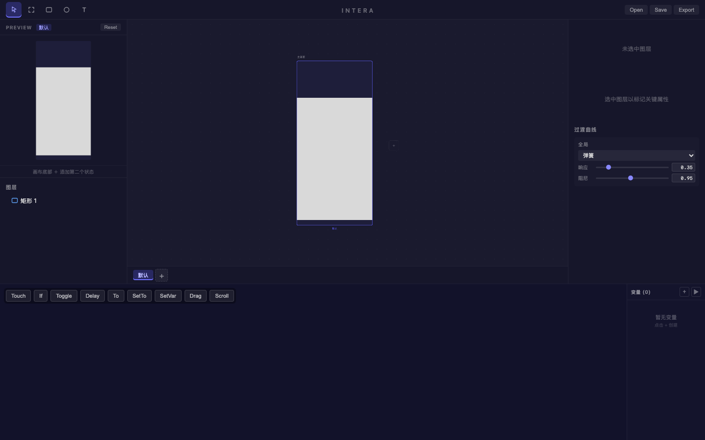
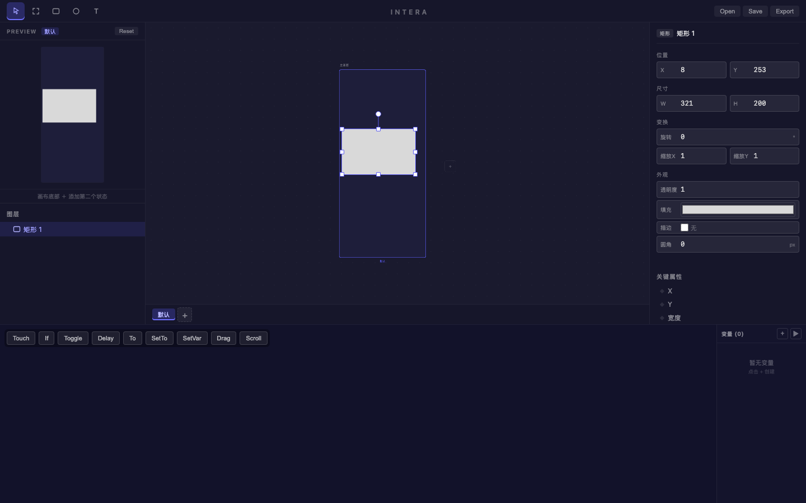
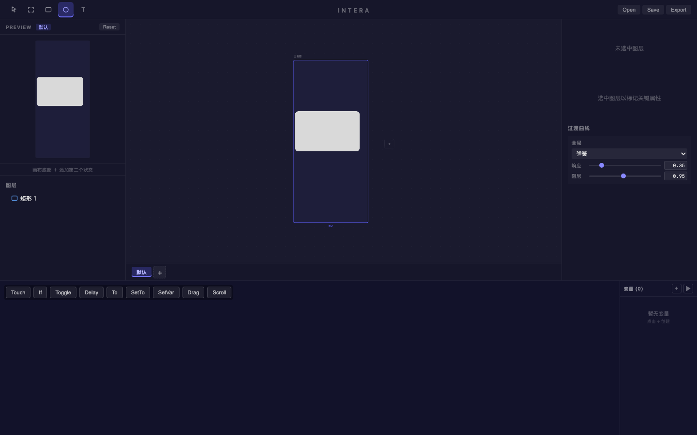
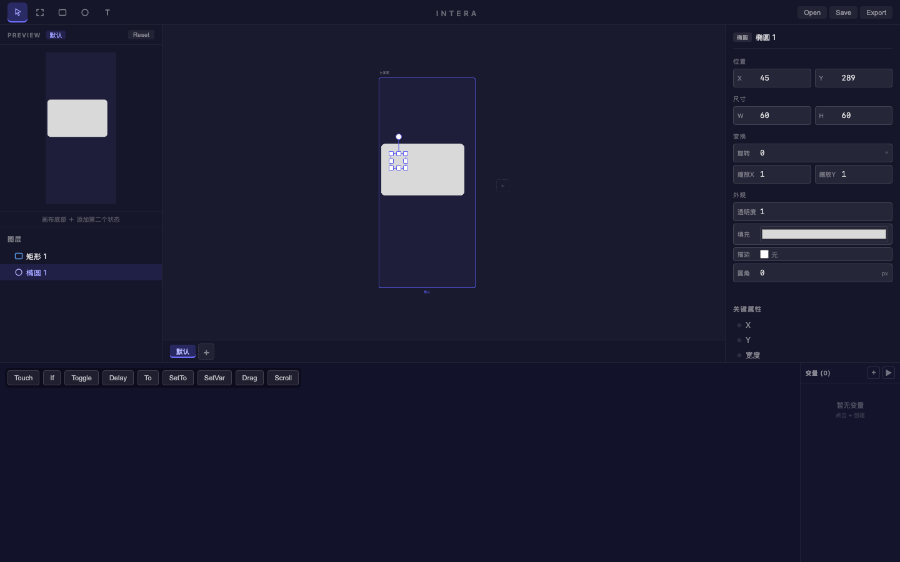
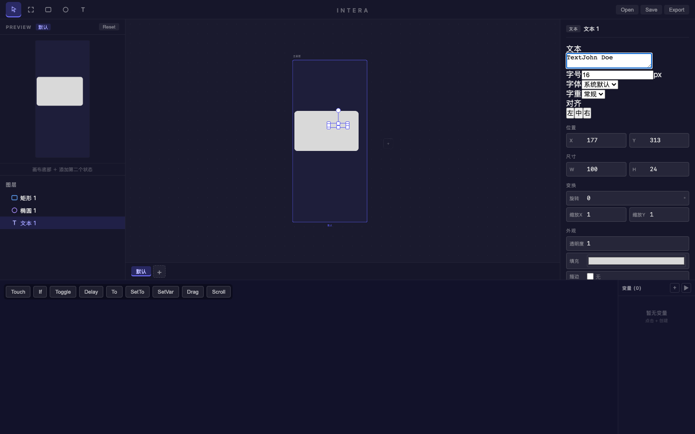

# 旅程: 基础绘制 — 个人卡片 UI

## 画像
∅（基础绘制）— 无额外能力集

## 设计目标
在画板上绘制一个简单的个人卡片：
- 矩形背景（约 320×200，浅色填充，圆角 16px）
- 圆形头像占位（60×60 椭圆）
- 标题文本 "John Doe"

## 过程

### Step 7 — 截图查看当前状态

画布上有一个之前绘制的矩形（W:844 H:603），尺寸偏大。属性面板可见但未选中图层。

### Step 8 — 点击矩形查看属性

点击矩形确认属性：X:-257, Y:180, W:844, H:603。尺寸远超目标 320×200。

### Step 9-14 — 尝试通过属性面板修改 W 值

多次尝试点击 W 输入框并用 Ctrl+A 选中内容，但 Ctrl+A 未能正确选中 input 内容。这是已知摩擦点（P2）。

**摩擦点 #1**: number input 的 Ctrl+A 行为不可靠 — 点击输入框后 Ctrl+A 有时选中画布图层而非 input 内容，导致无法可靠地替换输入值。

### Step 15-16 — 删除旧矩形，重新开始

决定删除过大的矩形，从头绘制正确尺寸的卡片。选中矩形 → Delete 键删除成功。

### Step 17 — 切换到矩形工具

按 R 切换到矩形工具，工具栏显示矩形工具激活。

### Step 18 — 绘制卡片背景矩形

根据缩放比例计算拖拽距离，绘制出 W:321 × H:200 的矩形，几乎完美命中目标尺寸。填充 #d9d9d9，描边开启。

### Step 19-25 — 设置圆角
尝试修改圆角值。点击圆角输入框 → Ctrl+A → 输入 "16"，但由于 Ctrl+A 未正确选中，"16" 被追加到 "0" 后面变成 "160"。

**摩擦点 #2**: 输入框值替换不直观 — Ctrl+A 在 number input 聚焦时未能选中内容，导致新值被追加而非替换。用户需要手动 Backspace 删除多余字符。

### Step 26-28 — 修正圆角为 16

通过 Backspace 删除末尾的 "0"，将圆角从 160 修正为 16。按 Enter 确认。矩形现在有合适的圆角。

### Step 29 — 尝试修改填充颜色
点击填充颜色输入，但原生 HTML color picker 在 Playwright 截图中不可见。已知 P2 问题：无 hex 输入、无色板。保持默认 #d9d9d9。

### Step 30-31 — 切换到椭圆工具

点击空白区域取消选中，按 O 切换到椭圆工具。

### Step 32 — 绘制头像占位圆

在卡片左上区域拖拽绘制椭圆，得到 W:60 × H:60 的完美圆形。位于 X:45, Y:289。

### Step 33-36 — 切换到文本工具并创建文本
按 T 切换文本工具，在头像右侧点击创建文本图层。尝试双击文本图层编辑时，意外创建了一个新椭圆（因为工具状态残留）。

**摩擦点 #3**: 工具状态在创建图层后不一致 — 创建文本图层后，双击画布上的文本图层时，工具可能仍处于之前的绘制模式，导致意外创建新图层而非编辑已有图层。

### Step 37 — 删除意外创建的椭圆
Delete 键删除了意外创建的椭圆 2。

### Step 38-43 — 编辑文本内容

切换到选择工具 (V)，点击文本图层选中，在属性面板的文本 textarea 中输入 "John Doe"。文本成功写入。

### Step 44-45 — 最终效果

个人卡片完成：
- 矩形背景 321×200，圆角 16px，填充 #d9d9d9
- 圆形头像占位 60×60
- 标题文本 "John Doe"
- 3 个图层：矩形 1、椭圆 1、文本 1

## 摩擦点

| # | 严重度 | 描述 | 状态 |
|---|--------|------|------|
| 1 | P2 | number input Ctrl+A 不可靠：点击 input 后 Ctrl+A 有时选中画布图层而非 input 内容 | 🔴 已知 |
| 2 | P2 | 输入框值替换不直观：Ctrl+A 失败后新值被追加而非替换，导致错误数值（如 0→016→160） | 🔴 已知 |
| 3 | P2 | 工具状态残留：创建文本图层后双击画布编辑时，可能触发之前工具的绘制行为 | 🔴 新发现 |

> 摩擦点 #1 和 #2 是同一根因的不同表现，已记录在 KNOWN-ISSUES.md。
> 摩擦点 #3 需要进一步调查：可能是文本工具创建后自动切回 Select 的时机问题。

## 体验审查

### 视觉一致性
- ✅ 属性面板: 标签对齐、输入框样式统一
- ✅ 工具栏: 激活态有明确视觉反馈
- ✅ 图层面板: 类型图标正确显示
- ✅ 字体层次: 标签和数值区分清晰

### 动画流畅度
- N/A: 基础绘制画像无动画（单状态）

### 交互品味
- ❌ 输入框编辑体验不够流畅 — Ctrl+A 选中行为不一致
- ✅ 绘制工具响应迅速，拖拽绘制手感好
- ✅ 快捷键切换工具流畅（R/O/T/V）
- ❌ 原生颜色选择器体验粗糙，无法精确输入 hex 值

## 结论
有摩擦待修 — 输入框 Ctrl+A 选中行为不一致是核心摩擦点，影响所有需要精确数值输入的操作。工具状态残留问题需要进一步调查。
