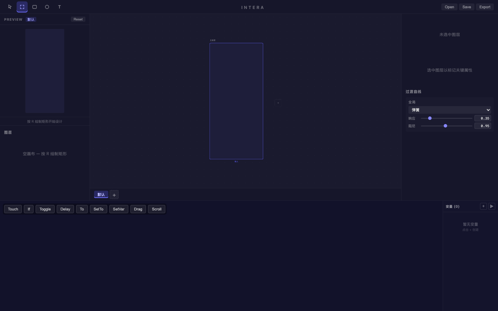
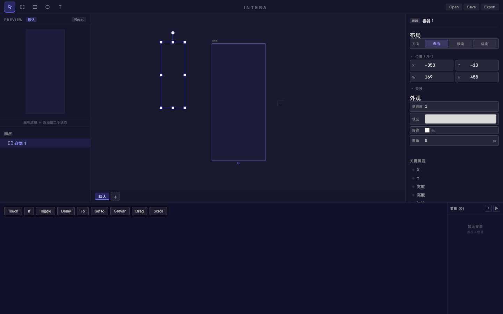
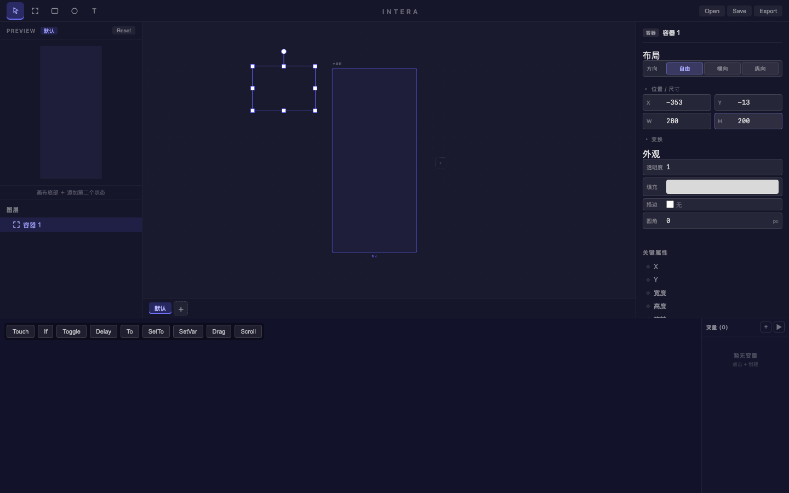
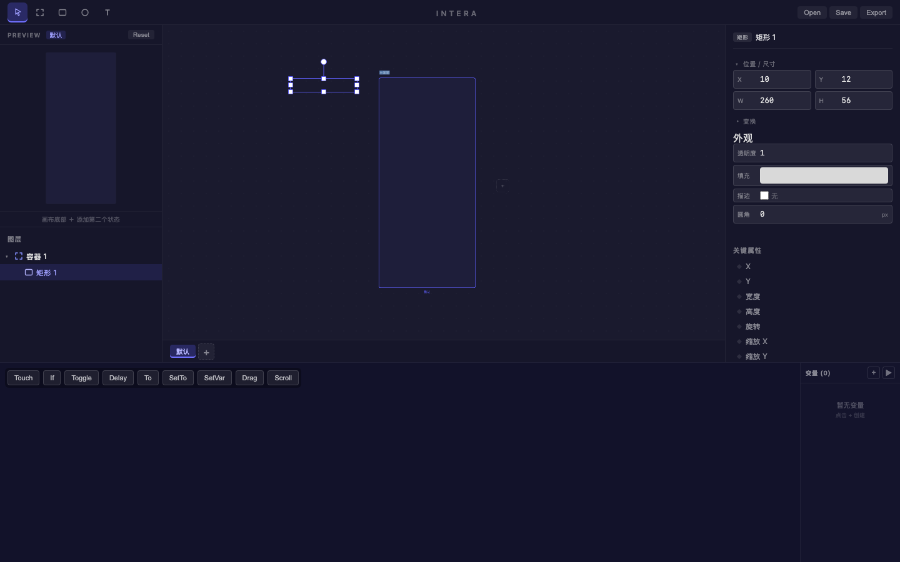
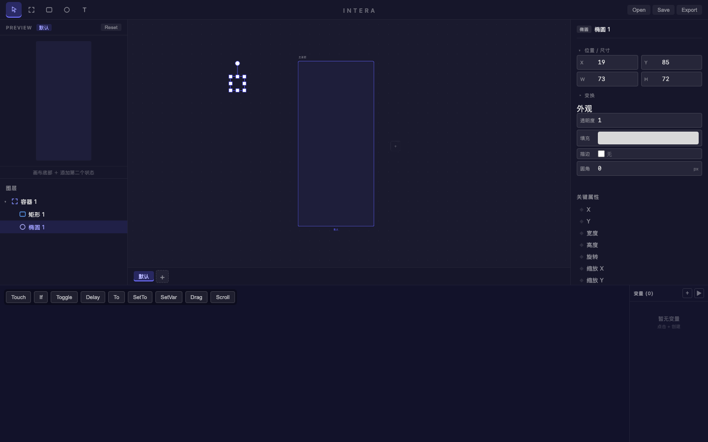
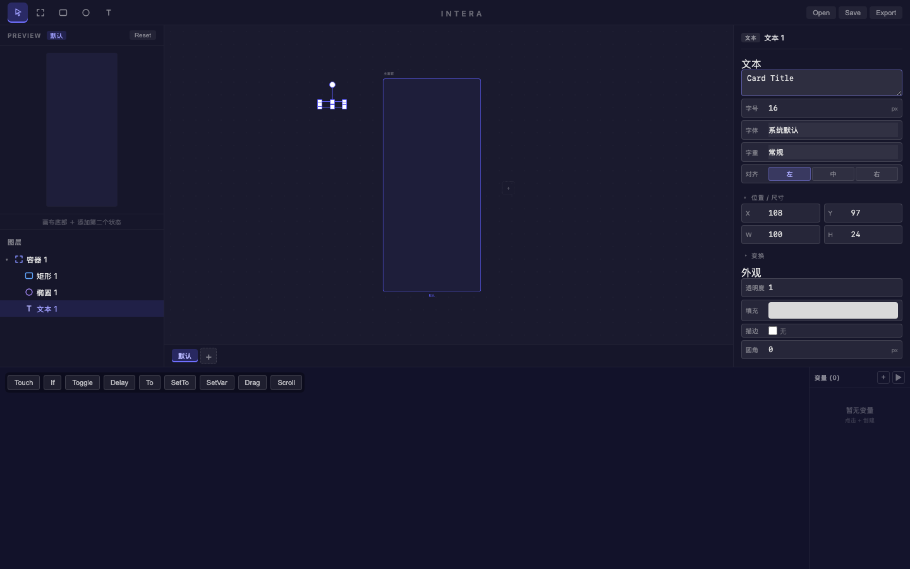

# 旅程: ∅ 空集画像 — 基础卡片布局

## 画像
∅（基础绘制）— 无额外能力集

## 设计目标
在画板上绘制一个简洁的卡片布局：
- Frame 容器（280×200，圆角 12px）
- 矩形装饰条（顶部横向 bar）
- 椭圆头像占位符
- 标题文本 "Card Title"

## 过程

### Step 1 — 初始状态

空画布，默认画板居中。左侧图层面板提示"空画布 — 按 R 绘制矩形开始设计"。右侧属性面板显示"未选中图层"，底部过渡曲线默认弹簧参数（响应 0.35、阻尼 0.95）。工具栏五个图标：选择(V)、容器(F)、矩形(R)、椭圆(O)、文本(T)。

**感受**: 界面布局清晰，新用户一眼能看到工具栏和空画布提示。

### Step 2 — 激活 Frame 工具

按 F 键，工具栏第二个图标（容器）高亮为蓝色边框，表示 Frame 工具已激活。其他区域无变化。

**感受**: 快捷键响应即时，激活态反馈明确。

### Step 3 — 绘制 Frame 容器

在画板内从 (460,120) 拖拽到 (530,310)，创建了 Frame "容器 1"。画布上出现带选择手柄的白色矩形。属性面板显示：X=-353, Y=-13, W=169, H=458。图层面板新增"容器 1"。

**感受**: 拖拽创建流畅，释放鼠标后自动选中并显示属性。但 169×458 太窄太高，像手机而非卡片——需要手动调数值。

### Step 8-11 — 修改宽度为 280
通过属性面板修改 W 值：点击 W 输入框 → Meta+A 全选 → 键入 "280" → Enter。

**关键发现**: Meta+A（macOS 的全选）在 number input 中工作正常！之前的旅程中 Ctrl+A 有问题，而这次用 Meta+A 绕过了那个摩擦点。W 从 169 成功改为 280。

### Step 12-15 — 修改高度为 200

同样流程修改 H 值：点击 H 输入框 → Meta+A → "200" → Enter。Frame 变成 280×200 的横向卡片形态。画布上选择手柄正确更新，预览面板也同步刷新。

**感受**: 属性编辑流程（点击 → 全选 → 键入 → 回车）顺畅自然。两次修改零摩擦。

### Step 16-19 — 设置圆角 12px
同样流程修改圆角值：点击"圆角"输入框 → Meta+A → "12" → Enter。圆角从 0 改为 12，卡片四角变圆。

**感受**: 属性编辑一致性好——宽/高/圆角三种数值字段，操作方式完全相同，零学习成本。

### Step 20-21 — 激活矩形工具绘制装饰条

按 R 切换矩形工具，在卡片顶部区域拖拽绘制。创建"矩形 1"（W:260, H:56），自动嵌入为"容器 1"的子元素。图层面板从平级变为树状展示：▾容器 1 → 矩形 1。

**感受**: 子元素自动嵌套非常符合直觉——在 Frame 内部拖拽就自动成为子级，不需要手动拖拽图层调整父子关系。

### Step 22-23 — 绘制椭圆头像占位

按 O 切换椭圆工具，在矩形下方左侧拖拽绘制。创建"椭圆 1"（W:73, H:72），接近正圆。同样自动嵌入容器。图层树：▾容器 1 → 矩形 1 + 椭圆 1。

**感受**: 绘制手感好。轻微的宽高不等（73×72）说明手动拖拽难以精确画正圆——可能需要 Shift+拖拽约束等比的功能。

**摩擦点 #1**: 拖拽绘制椭圆时没有 Shift 约束正圆的能力（或快捷键不明确），导致 73×72 的轻微变形。对头像占位符这种场景影响不大，但做 icon 或精确图形时会是问题。

### Step 24-29 — 绘制文本并输入内容
按 T 切换文本工具，在椭圆右侧拖拽创建文本区域。文本属性面板出现：输入文本框、字号(16)、字体(系统默认)、字重(常规)、对齐(左)。

点击属性面板的文本输入框 → Meta+A → 键入 "Card Title" → Enter。文本内容成功设置。

**注意**: Enter 在文本输入框中插入了换行符（显示为 "Card Title\n"），说明这是 textarea 而非 input。如果只想确认而不换行，可能需要点击其他地方或用 Tab。

**摩擦点 #2**: 文本内容输入框是 textarea，Enter 插入换行而非确认修改。对于单行标题，用户可能期望 Enter 是"确认"而非"换行"。不影响功能但违反短文本输入的直觉。

### Step 31 — 最终效果

卡片布局完成。图层面板清晰展示四层结构：
- ▾ 容器 1 (Frame 280×200, 圆角 12)
  - □ 矩形 1 (260×56, 顶部装饰条)
  - ○ 椭圆 1 (73×72, 头像占位)
  - T 文本 1 ("Card Title")

预览面板左上角实时反映完整卡片。右侧属性面板根据选中元素即时切换。

**感受**: 从空画布到完整卡片，全程约 30 步，核心创建步骤 ~10 步。工具切换快捷键 + 拖拽绘制 + 属性面板编辑的三板斧配合流畅。

### Step 32-33 — 选择/取消选择测试
点击画布空白区域成功取消选择（属性面板回到默认视图）。从图层面板点击"矩形 1"成功选中（属性面板即时显示矩形属性 X:10, Y:12, W:260, H:56）。

**感受**: 图层面板选中响应即时。

**摩擦点 #3**: 点击 Frame 内部空白区域不选中容器本身——点击穿透到画布背景。需要通过图层面板或点击 Frame 边框才能选中容器。对嵌套设计操作有一定干扰。

### Step 33 — 保存设计
调用 save，design.intera 文件写入成功（2281 bytes）。

## 摩擦点汇总

| # | 严重度 | 描述 | 状态 |
|---|--------|------|------|
| 1 | P3 | 拖拽绘制缺少 Shift 约束正圆/正方形（或快捷键不明显） | 待确认是否已有 |
| 2 | P3 | 文本内容 textarea 中 Enter 插入换行而非确认，短文本场景不直觉 | 🔴 待评估 |
| 3 | P3 | 点击 Frame 内空白区域不选中容器，需从图层面板操作 | 🔵 可能是设计意图 |

> 本次旅程未复现前次 Ctrl+A 的摩擦点——改用 Meta+A 后数值输入全程流畅。

## 体验审查

### 视觉一致性
- ✅ 属性面板: 标签对齐、输入框样式统一、间距均匀
- ✅ 工具栏: 激活态蓝色高亮反馈明确
- ✅ 图层面板: 类型图标 + 名称 + 展开/折叠 — 层级清晰
- ✅ 字体层次: 面板标题 > 属性标签 > 数值 — 区分分明
- ✅ 预览面板: 实时反映画布内容，更新及时
- N/A Patch 编辑器: ∅ 画像不涉及

### 动画流畅度
- N/A 弹簧动画: ∅ 画像无状态/动画
- ✅ 工具切换: 快捷键即时生效（<100ms 体感）
- ✅ 属性修改: Enter 后画布即时更新
- ✅ 选择/取消: 无延迟感

### 交互品味
- ✅ 操作直觉: F/R/O/T 快捷键 + 拖拽绘制 — 符合设计工具惯例
- ✅ 反馈及时: 每步操作都有即时视觉反馈
- ✅ 子元素自动嵌套: 在 Frame 内绘制自动成为子级，非常自然
- ✅ 属性编辑流程: 点击 → Meta+A → 输入 → Enter，一致且流畅
- ⚠️ 文本 Enter 语义: textarea 换行 vs 确认的歧义
- ⚠️ 容器穿透: 需要通过图层面板或边框选中 Frame

## 结论
基础绘图流程稳固。三个低优先级摩擦点不影响核心体验但值得后续打磨。对比前次旅程，Meta+A 替代 Ctrl+A 后数值编辑的核心摩擦消除了——这是重要进展。
