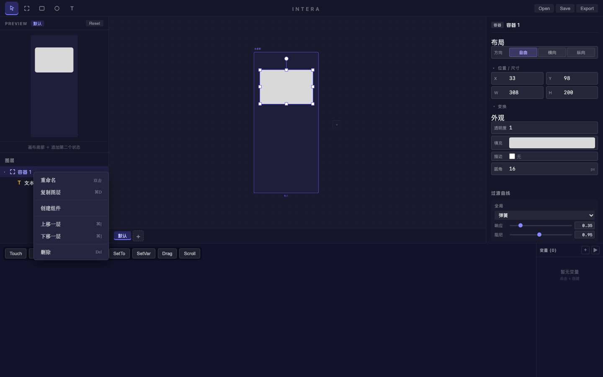
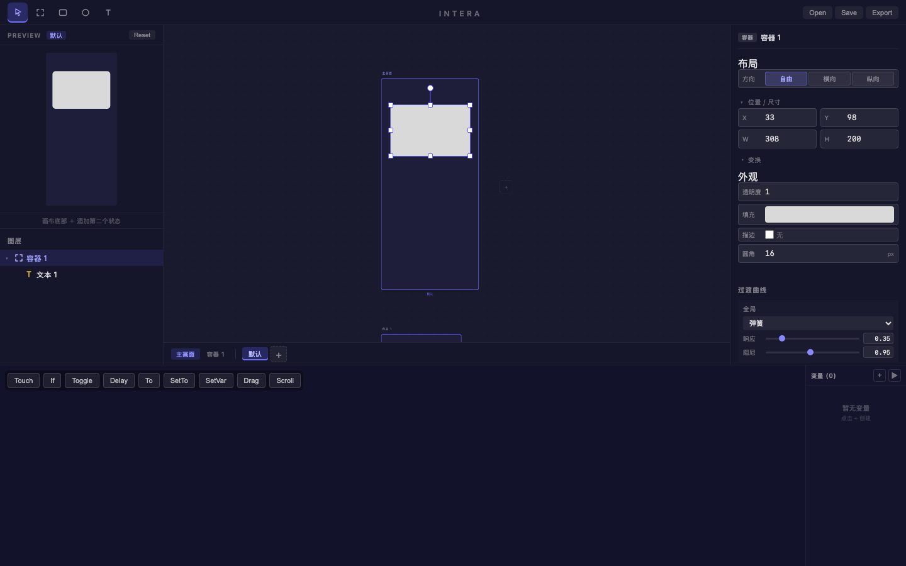
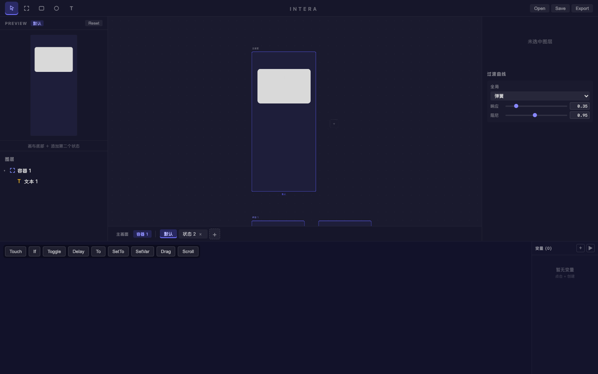
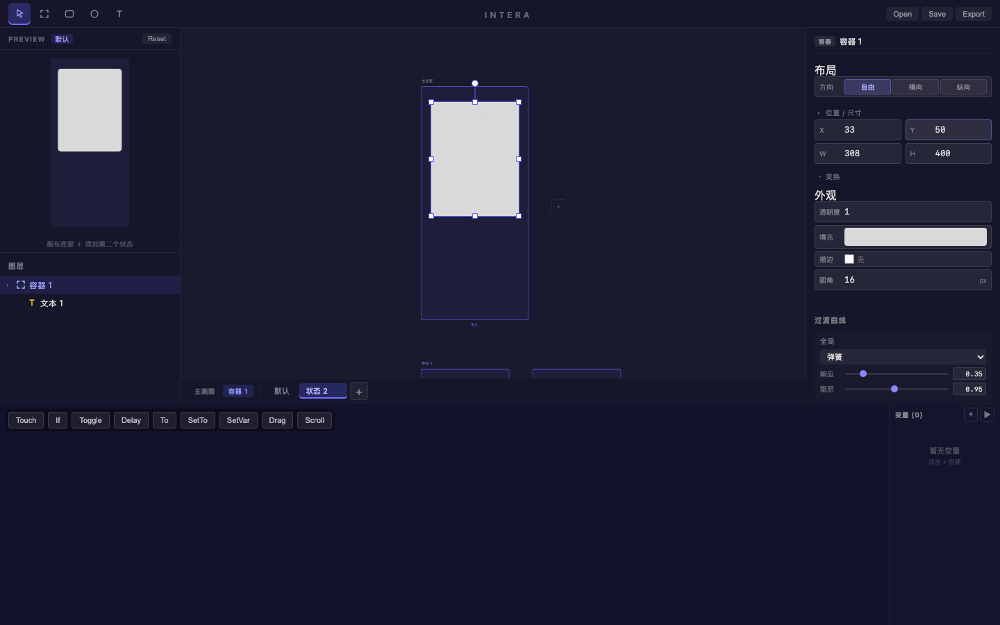
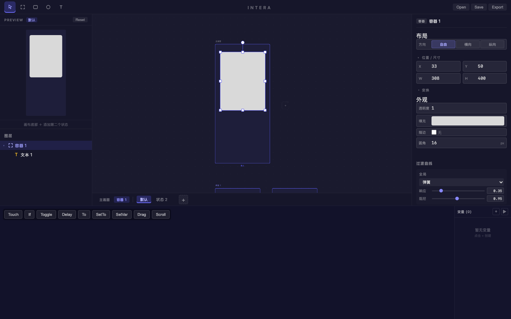

# 旅程: 组件演示 — 展开/收起卡片组件

## 画像
{states} — 具备多状态 + 属性覆盖能力

## 设计目标
演示如何使用 **组件 (StateGroup)** 功能创建独立的交互动效单元：
1. 创建一个 Frame 作为卡片容器
2. 添加文本子元素
3. 右键 Frame → "创建组件"
4. 给组件添加第二个状态
5. 在状态 2 中覆盖 Y 和 H 属性（展开效果）
6. 通过 Preview 验证状态切换动画

## 过程

### Step 1-6 — 创建卡片 Frame
在 Artboard 内拖拽创建 Frame "容器 1" (X:33, Y:98, W:308, H:200, 圆角:16)。
Frame 内添加文本 "Card Title"，字号 24。

### Step 24 — 右键创建组件
右键 "容器 1" → 出现上下文菜单，包含"创建组件"选项。

**注意**: 菜单项定位需要 evaluate 获取精确坐标，首次目测坐标偏差约 140px。

### Step 32 — 组件创建成功
"创建组件"生效后：
- 画布出现 **第二行** — 组件 "容器 1" 的独立画板
- 状态栏出现 **分组 pill**: "主画面" | "容器 1"
- 组件行只渲染 Frame 及其子树

### Step 37 — 添加状态 2
切换到 "容器 1" 分组 → 点击 "+" → 创建 "状态 2"。
组件行现在并排显示两个画板：默认 | 状态 2。

### Step 47 — 覆盖属性（展开效果）
在状态 2 中修改容器 1 的属性：
- Y: 98 → **50** (上移)
- H: 200 → **400** (展开)

主画板实时反映覆盖值，卡片明显变高并上移。

### Step 56 — Preview 状态循环
点击 Preview 区域触发自动循环，状态栏从 "状态 2" 切回 "默认"。
弹簧动画驱动 Y/H 过渡。

## 组件功能验证结果

| 功能 | 状态 | 说明 |
|------|------|------|
| Frame → 创建组件 | ✅ | 右键菜单正常工作 |
| 画布多行渲染 | ✅ | 组件独立一行，只渲染子树 |
| 分组 pill 切换 | ✅ | StateBar 显示并切换分组 |
| 组件内添加状态 | ✅ | "+" 按钮正常创建状态 |
| 状态内覆盖属性 | ✅ | Y/H 覆盖生效，画布实时更新 |
| Preview 自动循环 | ✅ | 点击触发状态切换 |

## 摩擦点汇总
| # | 严重度 | 描述 | 状态 |
|---|--------|------|------|
| 1 | P2 | 右键菜单坐标偏差: 目测 y≈354，实际 y≈497，差约 140px。需用 evaluate 获取精确坐标 | 已知 (journey-server 与截图缩放差异) |

## 结论
**组件核心链路通过。** Frame → 创建组件 → 多行画布 → 分组切换 → 状态覆盖 → Preview 循环，全链路验证成功。

缺失但不影响核心流程的 UI:
- 组件重命名/删除 (后端已有，UI 未暴露)
- 独立组件管理面板
