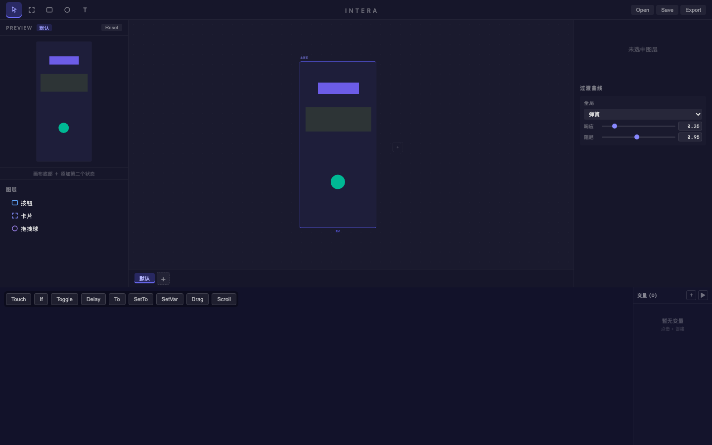
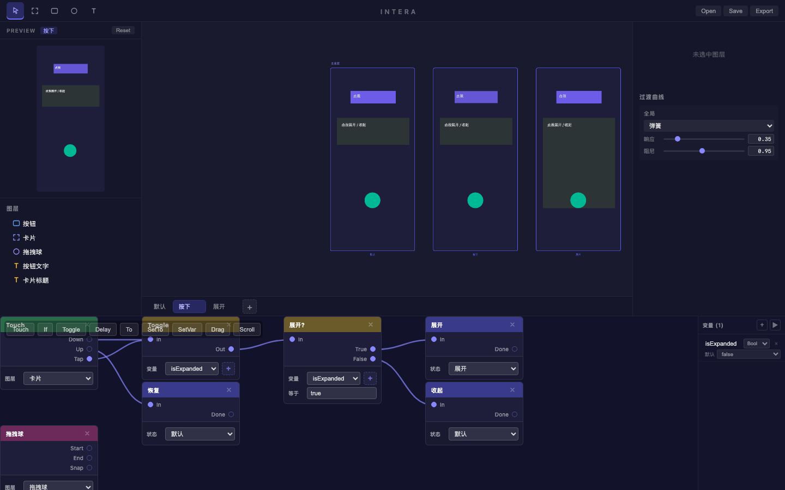
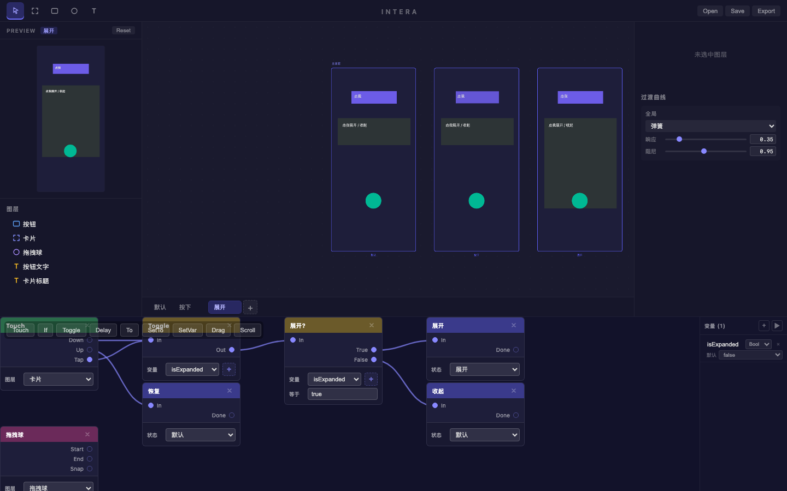
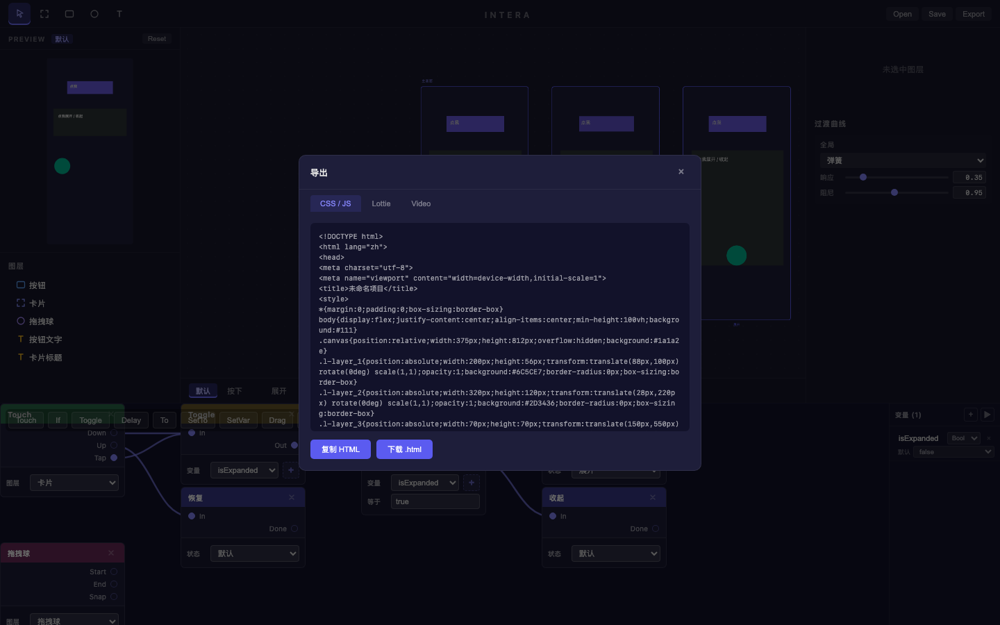

# 交互动效 Demo — 三种常见 Patch 交互演示

> **日期**: 2026-02-16
> **画像**: 交互设计师，快速验证 Patch 交互系统
> **输出**: `demo-interactions.intera` (项目根目录)

---

## 演示内容

在一块 375×812 手机画布上，搭建三个典型交互动效：

| # | 动效 | Patch 逻辑 | 状态 |
|---|------|-----------|------|
| 1 | 按钮按下反馈 | Touch.down → To(按下), Touch.up → To(默认) | 默认 ↔ 按下 |
| 2 | 卡片展开/收起 | Touch.tap → Toggle(isExpanded) → If → To(展开/收起) | 默认 ↔ 展开 |
| 3 | 拖拽跟手 | BehaviorDrag 绑定图层 | 连续位移 |

---

## 步骤回顾

### Step 1: 创建画布元素
- 紫色按钮 (矩形, `#6C5CE7`, 圆角28)
- 深灰卡片 (Frame, `#2D3436`, 圆角16)
- 绿色拖拽球 (椭圆, `#00B894`, 70×70)
- 按钮文字 "点我"、卡片标题 "点我展开 / 收起"

### Step 2: 一键应用 Sugar 预设
使用 `SugarPresets` 自动生成完整 Patch 图：

- `buttonFeedback(layer_1)` → 自动创建"按下"状态 (scaleX/Y: 0.95, opacity: 0.9) + Touch/To 节点 + 连线
- `toggleExpand(layer_2)` → 自动创建"展开"状态 (height: 400) + 变量 `isExpanded` + Touch/Toggle/If/To 完整逻辑链
- `addPatchNode('behaviorDrag', ...)` → 绑定拖拽球到 BehaviorDrag 行为

### Step 3: Preview 演示

**按钮按下反馈** — mousedown 触发 `按下` 状态，松开恢复 `默认`：

| 默认态 | 按下态 |
|--------|--------|
|  |  |

**卡片展开** — tap 触发 Toggle → 条件判断 → 切换到 `展开` 状态：

| 默认态 | 展开态 |
|--------|--------|
|  |  |

**拖拽跟手** — 手指按下绿色球拖动，球跟手移动：

| 拖拽前 | 拖拽中 |
|--------|--------|
|  |  |

### Step 4: 导出

支持三种格式：
- **CSS/JS** — 独立 HTML 文件，含完整交互逻辑
- **Lottie** — 动画描述文件
- **Video** — WebM 视频 (Canvas2D 离线渲染)

---

## 文件清单

- `design.intera` — Intera 项目文件 (6.3KB)
- `screenshots/` — 全部截图 (54+ 帧)
