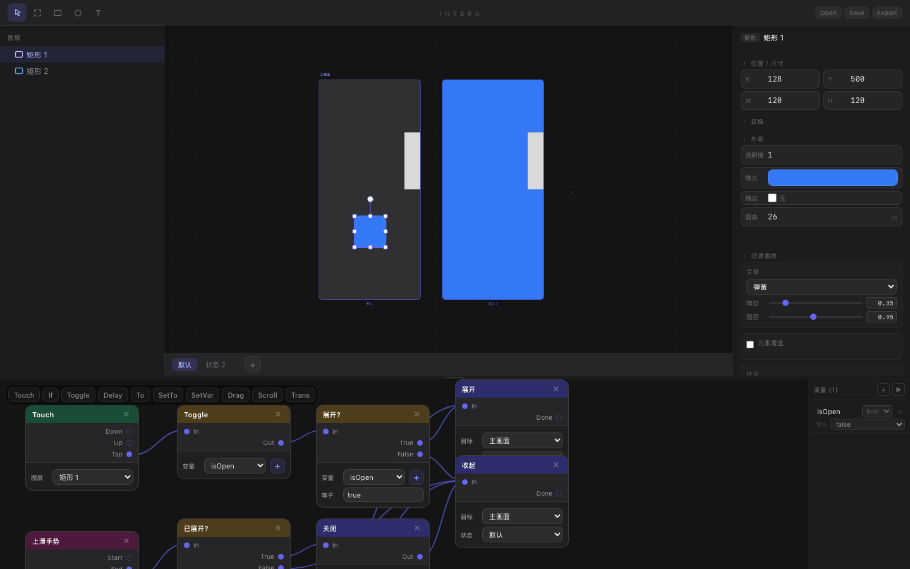
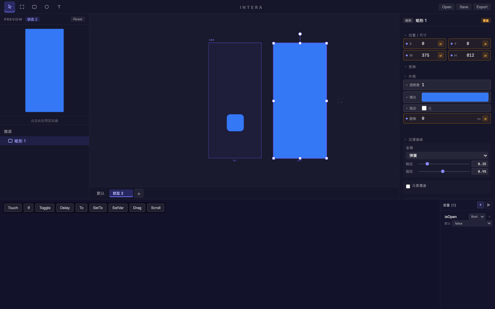
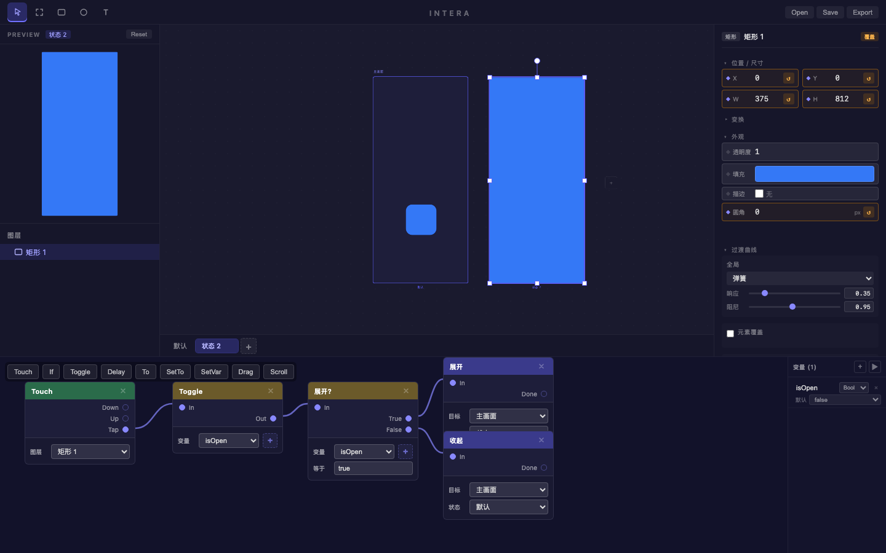
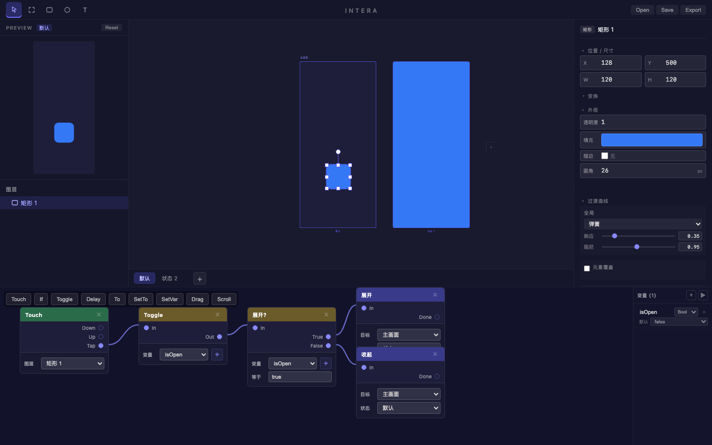

# 旅程: iOS 手势打开/关闭应用动效

> **日期**: 2026-02-17 06:33  
> **目标**: 在 Intera 中还原 iOS 手势点击打开、关闭应用的动效  
> **产出**: `design.intera` + 全过程截图 + Preview 演示

---

## 设计方案

### 交互意图

模拟 iOS 主屏点击应用图标，图标放大为全屏应用页面；再次点击，全屏收回为图标。

### 核心设计

| 概念       | 实现                                          |
| ---------- | --------------------------------------------- |
| **图层**   | 矩形 1 — 蓝色圆角矩形 (#3478F6)，模拟 App 图标 |
| **默认态** | x:128, y:500, 120×120, borderRadius:26        |
| **展开态** | x:0, y:0, 375×812, borderRadius:0 (全屏)     |
| **弹簧曲线** | response:0.5, damping:0.82 (iOS 风格)       |
| **变量**   | `isOpen` (boolean) — 控制展开/收起逻辑        |

### Patch 链路

```
Touch(矩形1).Tap → Toggle(isOpen) → Condition(isOpen==true)
                                      ├─ True  → To(状态 2)   // 展开
                                      └─ False → To(默认)     // 收起
```

---

## 操作流程

### 第一阶段: 创建图层与状态

1. **启动项目** — 打开 Intera 编辑器
2. **绘制矩形** — 按 R 选择矩形工具，在 Artboard 上拖拽绘制  
   → 遇到坐标偏差问题，通过 evaluate 获取 artboard-frame 精确 bbox 后修正
3. **设置默认属性** — x:128, y:500, 120×120, borderRadius:26, fill:#3478F6
4. **创建状态 2** — 添加第二个显示状态，设置展开 overrides

| 属性 | 默认 | 状态 2 |
|------|------|--------|
| x | 128 | 0 |
| y | 500 | 0 |
| width | 120 | 375 |
| height | 120 | 812 |
| borderRadius | 26 | 0 |

### 第二阶段: 构建交互逻辑

5. **创建变量** — `isOpen` (boolean, 默认 false)
6. **构建 Patch 图** — Touch → Toggle → Condition → To(展开) / To(收起)
7. **配置弹簧曲线** — response:0.5, damping:0.82

### 第三阶段: 验证效果

8. **Preview 面板** — 点击蓝色图标触发展开动画
9. **再次点击** — 触发收起动画，回到图标状态
10. **导出文件** — 提取项目 JSON 存为 `design.intera`

---

## 关键截图

| 步骤 | 截图 | 说明 |
|------|------|------|
| 初始画布 |  | 矩形绘制到 Artboard 上 |
| 双状态视图 |  | Canvas 同时展示默认态和展开态 |
| Patch 连线 |  | 完整交互逻辑链路 |
| Preview 图标态 |  | Preview 面板中的图标状态 |
| Preview 展开态 |  | 点击后展开为全屏 |
| Preview 收回 |  | 再次点击收回为图标 |

---

## 摩擦点

### F-001: Artboard 坐标偏差

- **现象**: 在 Canvas 上拖拽绘制矩形失败，图层面板一直显示空画布
- **根因**: Canvas viewport 有缩放和偏移，journey-server 的鼠标坐标落在 artboard-frame 外部
- **解决**: 通过 evaluate 获取 `.artboard-frame` 的 `getBoundingClientRect()`，修正拖拽坐标

### F-002: Preview 点击不响应

- **现象**: 在 Preview 面板点击后动画没有触发
- **根因**: 点击坐标没有精确命中 `data-layer-id` 元素
- **解决**: 通过 evaluate 获取 Preview 中图层元素的精确 bbox，调整点击坐标

### F-003: 画布框选只支持画板内起手 + 选框偏移

- **现象**: 框选只能在关键帧画板内起手，画板外起手无效；拖拽时选框与光标有偏移
- **根因**: 框选逻辑基于画板局部坐标，渲染时又叠加了 viewport pan，导致坐标系不一致
- **解决**: 2026-02-18 重构为 viewport 坐标系框选；命中改为当前激活状态画板 DOM 相交检测；修复 `activeGroup` 同步时序

---

## 产出文件

- `design.intera` — 完整项目文件，可在 Intera 中打开
- `ios-app-open-close.webm` — 动效录屏 (WebM, Canvas2D 离线渲染)
- `screenshots/` — 46 步全过程截图

---

## 2026-02-18 回归验证 (Flow E)

目标: 验证「画布图层编辑 — 框选 / 多选 / 右键」修复是否生效。

关键步骤:

1. 在画布创建两个矩形图层（`矩形 1`、`矩形 2`）
2. 从画布空白区 (画板外) 起手拖拽进入画板，进行框选
3. 截取拖拽中间帧，检查选框与光标对齐
4. 在画布图层上右键，检查上下文菜单触发

结果:

- ✅ 画板外起手框选可用
- ✅ 框选可一次选中多个图层
- ✅ 拖拽中选框与光标对齐（BDD 断言误差 <= 2px）
- ✅ 画布图层右键菜单可触发

证据截图:

- 框选起手与结束: `screenshots/step-30.png`
- 拖拽中间帧: `screenshots/step-33.png`
- 右键菜单验证: `screenshots/step-36.png`

对应自动化:

- `npx playwright test tests/intera.spec.ts --grep "Feature: 图层管理"` → `5 passed`

## 技术洞察

**iOS 动效的本质不是"做动画"，而是"描述状态转换意图"**

传统方案会用 keyframe 时间线逐帧编排。Intera 的思路是:
1. 只定义两个端点状态（图标 / 全屏）
2. 用一个布尔变量控制方向
3. 让弹簧物理引擎自动插值

这正是 Apple 的设计哲学 — 好的动效来自正确的状态模型，不是复杂的时间线。
